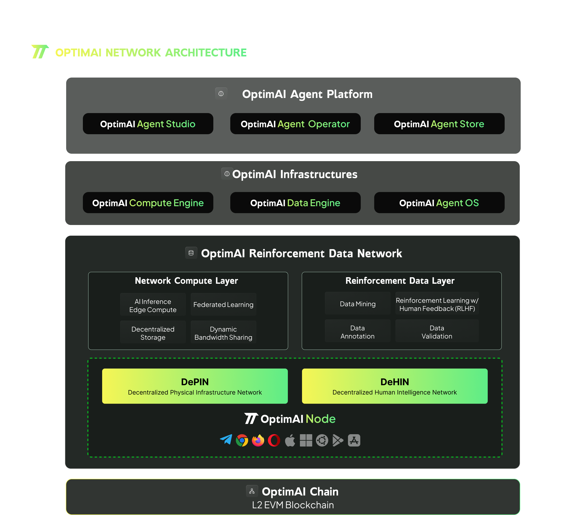

# OptimAI Network Architecture
OptimAI is a decentralized ecosystem designed for efficient, secure, and scalable AI data collection and development. It integrates advanced technologies to address modern challenges while remaining adaptable for future advancements. Its architecture is built on four core pillars: OptimAI DePIN Network, OptimAI Browser Nodes, OptimAI Reinforcement Data Layer and OptimAI OP-Stack Layer 2 Blockchain.

OptimAI Network is designed to be a community-driven network. Users are not just participants but active contributors to the evolution of AI technology. Community members contribute data, validate information, and run nodes to help grow the network and improve AI models. By contributing to OptimAI, users help build a more intelligent and accessible AI ecosystem. The data and computing power provided by the community fuel the continuous learning and adaptation of AI agents.

### OptimAI DePIN Network
- Description: A global, user-operated network leveraging shared computing resources.
- Key Features:
  - Resource sharing for scalability and cost-efficiency.
  - Decentralization ensures reliability and security.
  - OPI token rewards incentivize participation.
- Benefits: Enhances scalability, reduces infrastructure costs, and improves network resilience.

### OptimAI Integrated Browser Nodes
- Description: A web browser integrated with a DePIN node for intuitive data collection.
- Key Features:
  - Local data processing ensures privacy and compliance.
  - Captures authenticated platform data (e.g., Twitter, Facebook).
  - Offers user control over data collection preferences.
  - Integrates anonymization and edge computing for efficiency and security.
- Benefits: Enables effortless user participation, enriches data quality, and protects privacy.

### OptimAI Reinforcement Data Layer
- Description: Manages data flow from collection to AI training using feedback loops and community validation.
- Key Features:
  - Automated data cleaning and validation pipelines.
  - Reinforcement learning improves data quality over time.
  - Engages users in collaborative data validation.
- Benefits: Produces high-quality datasets, streamlines processing, and fosters community involvement.

### OptimAI OP-Stack Layer 2 Blockchain
- Description: A scalable blockchain supporting transactions, smart contracts, and decentralized governance.
- Key Features:
  - Layer 2 scalability reduces costs and increases throughput.
  - Smart contracts manage data transactions and incentivization.
  - Decentralized governance empowers token holders.
  - Security inherits strength from Layer 1 blockchains like Ethereum.
- Benefits: Ensures transparency, enhances security, and enables collaborative governance.