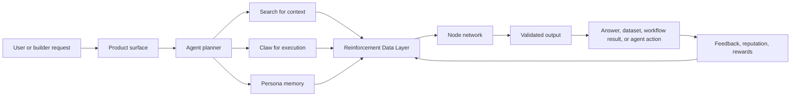

import ImageWithCaption from '@site/src/components/ImageWithCaption';
import architectureImage from './assets/images/architecture.png';
import ecosystemImage from './assets/images/ecosystem.png';

# OptimAI Architecture

OptimAI is built around a simple product architecture:

- **Search** provides live, source-backed context.
- **Claw** turns context into execution.
- **Persona Agent** gives agents user-approved memory and identity.
- **Nodes** supply data access, validation, compute, bandwidth, and execution capacity.
- **Marketplace, OPI, and OptimAI Chain** coordinate distribution, access, reputation, and rewards.

This page explains how those parts fit together.

<ImageWithCaption
  src={architectureImage}
  alt="OptimAI Network architecture"
  caption="OptimAI architecture: products, services, data, nodes, and coordination."
/>

## Architecture Summary

OptimAI separates the system into three concerns:

1. **Product composition:** Search, Claw, Persona, APIs, MCP, x402, and Marketplace.
2. **Service execution:** Agent, Data, Compute, Network, and Trust engines.
3. **Network coordination:** nodes, validators, reinforcement data, OPI, reputation, and governance.

This separation matters because agent systems become fragile when retrieval, execution, memory, data quality, and incentives are mixed together without clear boundaries.

## Layer Model

| Layer | Role | Main components |
| --- | --- | --- |
| **Product layer** | User and builder surfaces. | OptimAI Search, OptimAI Claw, Persona Agent, APIs, MCP, SDKs |
| **Agent layer** | Plans, remembers, retrieves, extracts, acts, and learns from feedback. | task planners, memory, tool routing, workflow state |
| **Service layer** | Turns product requests into data, compute, trust, and network tasks. | Agent Engine, Data Engine, Compute Engine, Network Engine, Trust Engine |
| **Reinforcement data layer** | Converts raw signals into trusted AI context. | mining, parsing, validation, provenance, quality scoring, feedback |
| **Node layer** | Runs distributed work. | Lite Node, Core Node, Edge Node, CLI Node, Telegram Node, validators |
| **Coordination layer** | Tracks contribution, distribution, and value flow. | Marketplace, OptimAI Chain, OPI, rewards, staking, governance |

## Architecture Planes

A production-grade agent network needs clear separation between product experience, execution, trust, and value flow.

| Plane | What it owns | Why it matters |
| --- | --- | --- |
| **Experience plane** | Search UI, Claw workflows, Persona profiles, builder tools. | Gives users and developers coherent product surfaces. |
| **Execution plane** | Core Node runtime, CLI Node, task orchestration, Claw jobs, compute workloads. | Moves agents from responses to real workflow execution. |
| **Data plane** | source ingestion, parsing, embeddings, extraction records, memory objects, datasets. | Keeps agent context structured and reusable. |
| **Trust plane** | provenance, freshness, validation, reputation, feedback, permission rules. | Makes outputs inspectable instead of opaque. |
| **Economic plane** | OPI rewards, marketplace payments, campaigns, staking, governance. | Aligns contributors, builders, users, and the protocol. |

## Control Flow vs Data Flow

OptimAI separates the **control flow** that decides what should happen from the **data flow** that carries source material, records, memory, and outputs.

| Flow | Description | Examples |
| --- | --- | --- |
| **Control flow** | Plans, policies, permissions, routing, retries, and settlement. | Agent Engine, Trust Engine, Network Engine, OPI reward events |
| **Data flow** | Sources, chunks, embeddings, extracted fields, citations, memory, datasets. | Data Engine, Reinforcement Data Network, Persona memory, Claw records |

Keeping these separate makes the system easier to inspect. A user should be able to ask both “what did the agent use?” and “why was it allowed to use it?”

## End-To-End Flow

## Product Roles

### Search: Context Layer

Search gives agents current context from the open web, social sources, indexed data, and network-refreshed sources. It is not only a search box; it is the retrieval surface that other OptimAI products can call when they need source-backed information.

### Claw: Execution Layer

Claw is the native agent runtime inside the Core Node environment. It can take a goal, plan subtasks, gather context, extract structured records, generate reports, and carry a workflow closer to completion.

### Persona Agent: Memory Layer

Persona Agent stores user-approved preferences, projects, workflows, source lists, and decisions. It gives agents continuity without forcing users to repeat the same context every session.

### Nodes: Infrastructure Layer

Nodes provide the distributed network behind the products:

- **Lite Node:** low-friction participation through browser extension and Telegram.
- **Core Node:** desktop and CLI execution for Claw, browser-native workflows, extraction, compute, and campaign tasks.
- **Edge Node:** mobile participation and future local-context workflows.

## Service Responsibilities

| Service | Responsibility |
| --- | --- |
| **Agent Engine** | Plan workflows, route tools, maintain state, and coordinate Search, Claw, Persona, and APIs. |
| **Data Engine** | Parse, clean, normalize, embed, enrich, package, and route data for validation. |
| **Compute Engine** | Assign processing, embeddings, inference support, and campaign workloads to eligible resources. |
| **Network Engine** | Coordinate nodes, task routing, bandwidth, health, reliability, and secure communication. |
| **Trust Engine** | Apply permission checks, provenance requirements, freshness thresholds, validation policy, and quality scoring. |

For a deeper service-level breakdown, see [OptimAI Services](./services.md).

## Builder Interfaces

OptimAI exposes the network through developer surfaces that match the product stack:

| Interface | Purpose |
| --- | --- |
| **Search MCP** | Let MCP-compatible agents use OptimAI Search as a live context tool. |
| **Search API** | Add source-backed retrieval to products and backends. |
| **x402 SDK** | Build paid, agent-native search flows with payment-aware requests. |
| **Claw preview jobs** | Model extraction, monitoring, and workflow execution contracts. |
| **Persona preview memory** | Model user-approved memory objects for agent personalization. |
| **Schemas** | Standardize sources, citations, Claw records, Persona memory, campaigns, node capabilities, and reward events. |

## Trust Model

OptimAI should treat trust as a data property, not a marketing claim. Useful outputs need:

- source URL or origin
- capture timestamp
- node or workflow metadata
- extraction method
- validation status
- freshness score
- quality score
- user or validator feedback where relevant

## Architecture Guarantees To Aim For

These are design targets for a mature OptimAI system:

| Guarantee | Meaning |
| --- | --- |
| **Inspectable output** | Users can see sources, citations, memory use, and validation status where relevant. |
| **Permissioned execution** | Sensitive data and authenticated sources require explicit policy checks. |
| **Portable context** | Search results, Claw records, Persona memories, and datasets use consistent object models. |
| **Composable tools** | Search MCP, APIs, x402, Claw jobs, and Persona memory can be combined in agent workflows. |
| **Rewardable contribution** | Accepted node and validator work can produce reputation and reward signals. |

## Why The Architecture Matters

Most AI products fail at the handoff: they can summarize, but not execute; retrieve, but not remember; answer, but not verify; personalize, but not give users control. OptimAI connects those missing parts into one network.

<ImageWithCaption
  src={ecosystemImage}
  alt="OptimAI ecosystem"
  caption="OptimAI ecosystem: node operators, validators, builders, users, products, and OPI incentives."
/>

## Design Principles

- **Current context:** Agents need live data, not stale snapshots.
- **User control:** Permissioned sources and personal memory should stay under user control.
- **Provenance by default:** Important outputs should show where they came from.
- **Composable products:** Search, Claw, and Persona should work separately and together.
- **Network-aligned incentives:** The people who contribute useful data, compute, and validation should be rewarded.
- **Graceful maturity:** Production interfaces should be stable; preview interfaces should be clearly labeled until contracts are final.
