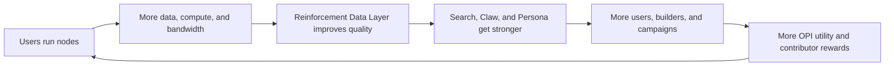
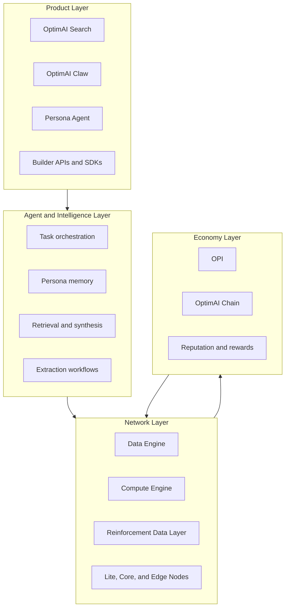
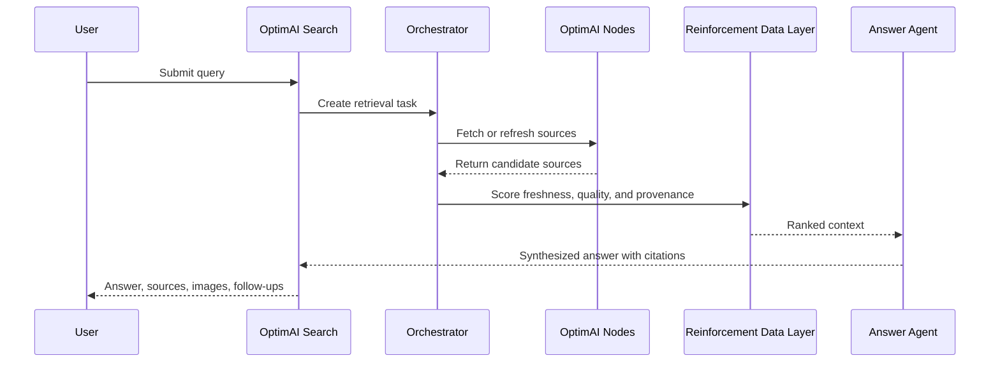
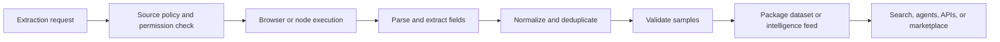
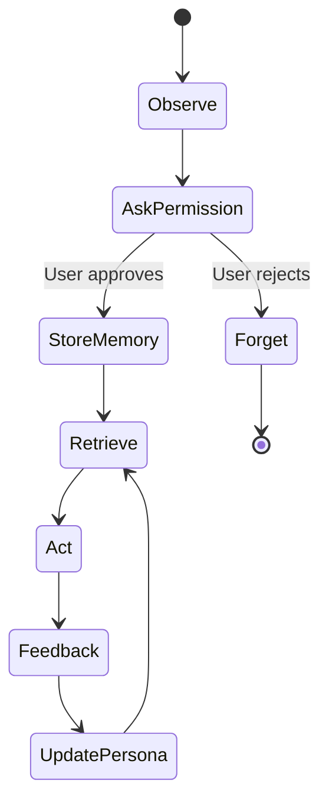
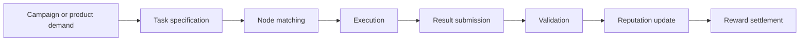
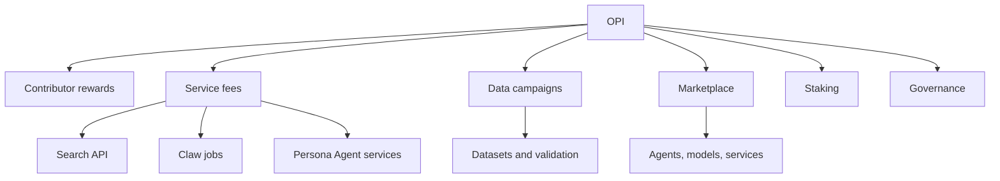
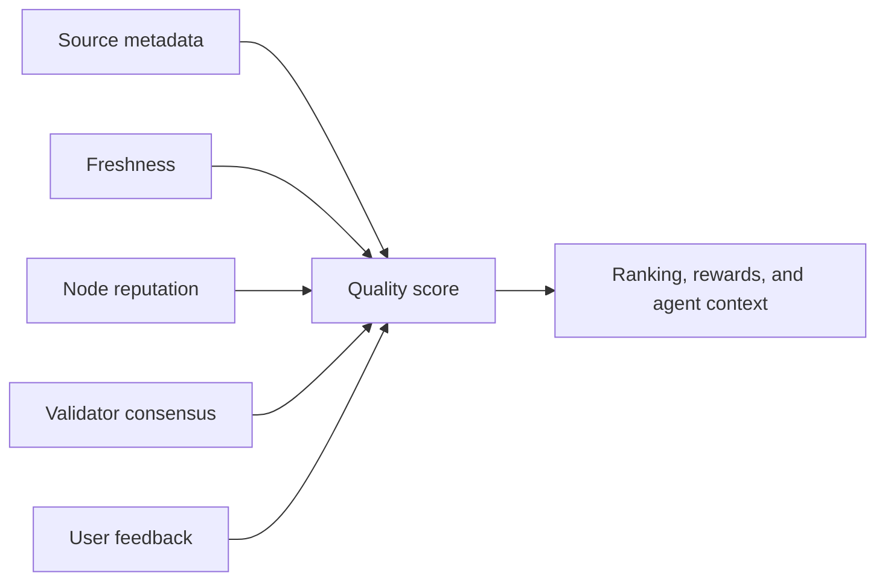

# System Diagrams

This page collects the core OptimAI diagrams in one place. Use it when explaining the network to builders, partners, investors, contributors, and new team members.

## OptimAI Network Flywheel

## Product Stack

## Search Request Flow

## Claw Extraction Flow

## Persona Agent Memory Loop

## Node Task Lifecycle

## OPI Utility Map

## Trust And Quality Model

