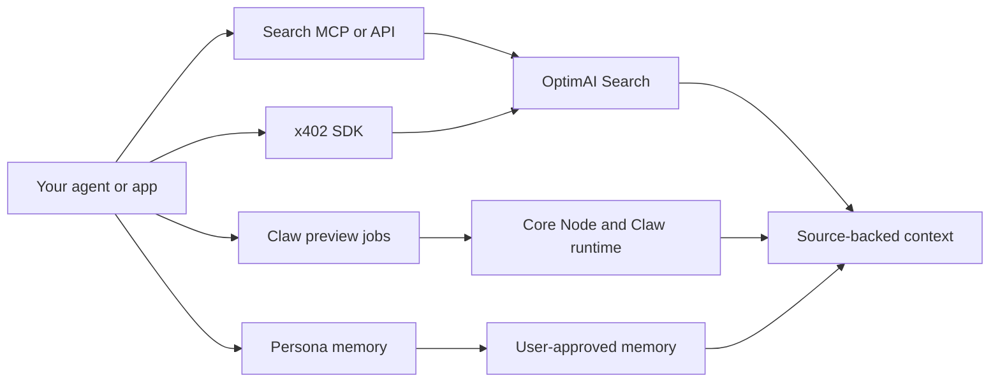

# Developer Get Started

OptimAI gives builders several ways to add live intelligence to agents and applications.

## Choose An Integration Path

| Path | Use when |
| --- | --- |
| **OptimAI Search MCP** | You want an MCP-compatible agent or coding tool to call OptimAI Search as a tool. |
| **Search API** | You want server-side access to source-backed search results. |
| **x402 SDK** | You want paid, agent-native search flows with HTTP 402-style payment handling. |
| **Claw preview APIs** | You are designing extraction, monitoring, or workflow jobs that Claw can execute. |
| **Persona preview APIs** | You need user-approved memory objects for personal or domain-specific agents. |

## Current Public Builder Surfaces

- [`@optimai-network/search-mcp`](https://github.com/OptimaiNetwork/optimai-search-mcp): MCP server for OptimAI Search.
- [`@optimai-network/x402-sdk`](https://github.com/OptimaiNetwork/optimai-x402-sdk): typed client for x402 search flows.
- [OptimAI Search Skill](https://github.com/OptimaiNetwork/optimai-search-skill): installable guidance for AI coding agents using Search MCP and x402.
- [OptimAI GitHub](https://github.com/OptimaiNetwork): public repositories for docs, CLI, search MCP, x402, cookbooks, and related tooling.

## Recommended First Build

Start with Search MCP. It gives an agent access to live OptimAI Search without requiring you to design your own API wrapper.

```bash
export OPTIMAI_API_KEY="sk-..."

codex mcp add optimai-search \
  --env OPTIMAI_API_KEY="$OPTIMAI_API_KEY" \
  -- npx -y @optimai-network/search-mcp
```

Then restart your MCP-compatible host and confirm the `optimai-search` tools are available.

## Tooling Model



## Build Principles

- Show citations and source links in user-facing answers.
- Store request IDs for debugging.
- Treat API examples marked preview as design contracts, not final production references.
- Keep API keys server-side.
- Ask for explicit user approval before saving Persona memory.
- Use async job patterns for long-running search, extraction, or campaign tasks.
