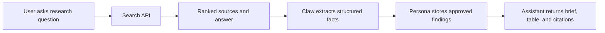
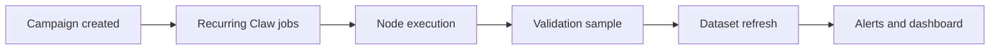
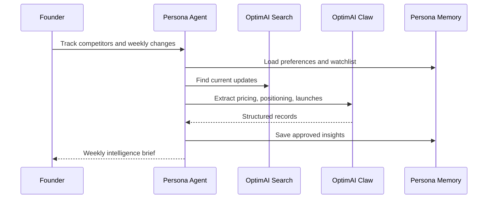
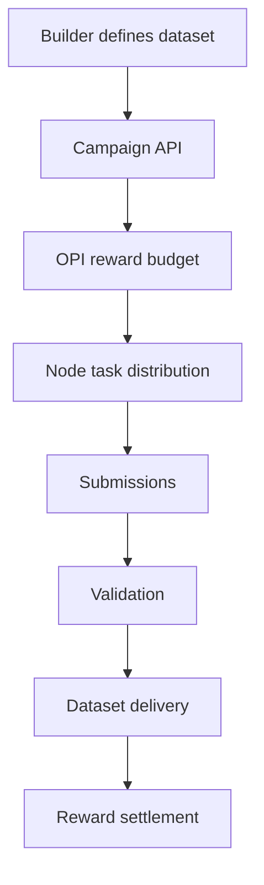
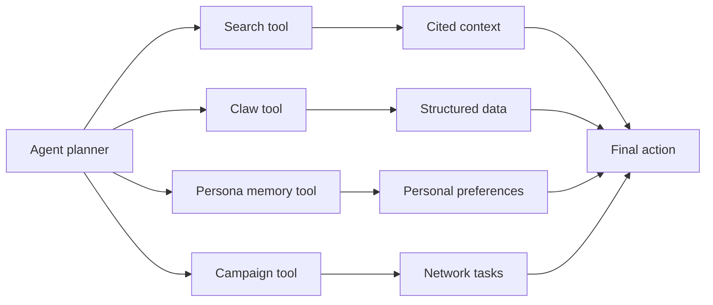

# Builder Workflows

This page shows how OptimAI products compose into practical builder workflows.

## Workflow 1: Source-Backed Research Assistant



### Steps

1. Use Search API to retrieve fresh context.
2. Use Claw API to extract structured facts from top sources.
3. Save approved insights into Persona memory.
4. Return a cited brief with tables and follow-up questions.

### Output

```json
{
  "brief": "The market is moving toward agent-native data infrastructure...",
  "table": [
    {
      "company": "Example AI",
      "category": "agent tooling",
      "evidence_url": "https://example.com"
    }
  ],
  "memory_suggestions": [
    "User is researching decentralized AI data networks."
  ]
}
```

## Workflow 2: Claw-Powered Market Monitor



### Steps

1. Create a campaign for a market or narrative.
2. Schedule recurring Claw extraction jobs.
3. Validate a sample through the reinforcement layer.
4. Refresh the dataset and trigger alerts when signals change.

### Best for

- crypto narratives
- competitor tracking
- product pricing changes
- social sentiment
- ecosystem mapping

## Workflow 3: Personal Founder Agent



### Steps

1. Store the founder’s watchlist, competitors, and preferred format.
2. Search for recent activity.
3. Extract structured updates.
4. Save approved conclusions.
5. Deliver a concise weekly brief.

## Workflow 4: Data Campaign For Builders



### Steps

1. Define the dataset objective and schema.
2. Fund the campaign with an OPI reward budget.
3. Route extraction or validation tasks to eligible nodes.
4. Validate submissions.
5. Deliver the dataset and settle rewards.

## Workflow 5: Agent Toolchain



### Pattern

Agents should treat OptimAI as a tool layer:

- Search for live context.
- Claw for structured data.
- Persona for memory.
- Campaigns for large or recurring jobs.
- Rewards and reputation for network accountability.
