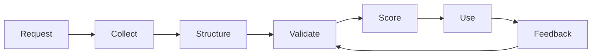

# Reinforcement Data Network

OptimAI’s data layer exists for one reason: agents need context they can trust.

Raw data is not enough. A useful agent needs to know where information came from, when it was captured, whether it is current, how it was extracted, and whether it has been checked. OptimAI calls this pipeline the **Reinforcement Data Network**.

## Data Loop

| Stage | What happens | Output |
| --- | --- | --- |
| **Request** | A user, agent, API, or campaign asks for context. | task specification |
| **Collect** | Nodes, Search, Claw, or connectors gather candidate sources. | raw source set |
| **Structure** | Content is parsed, chunked, normalized, embedded, and enriched. | records and metadata |
| **Validate** | Automated checks and human review test relevance and quality. | validation state |
| **Score** | The network assigns freshness, provenance, confidence, and usefulness signals. | quality profile |
| **Use** | Search, Claw, Persona, APIs, or campaigns consume the trusted context. | answer, dataset, action, memory |
| **Feedback** | Users and validators correct or approve outputs. | stronger future ranking and rewards |

## Source Types

OptimAI can work with multiple classes of data, depending on product permissions and task design:

- public websites and search results
- social and community sources
- documents and knowledge bases
- browser workflows and dynamic pages
- user-approved authenticated sources
- mobile and edge contexts
- validator feedback and annotations
- on-chain or marketplace metadata where relevant

## Quality Signals

The data layer should preserve the signals an agent needs to reason safely:

| Signal | Why it matters |
| --- | --- |
| **Provenance** | Shows the origin of a claim, record, or extracted field. |
| **Freshness** | Helps agents avoid stale context. |
| **Source reputation** | Indicates whether a source has historically been useful or reliable. |
| **Node reputation** | Weights output from nodes based on past task quality. |
| **Validation status** | Shows whether a record was sampled, reviewed, or accepted. |
| **User feedback** | Turns corrections and approvals into future ranking signals. |
| **Task fit** | Measures whether a result actually satisfies the original request. |

## Product Use

### Search

Search uses the data layer to rank sources, synthesize answers, and expose citations.

### Claw

Claw uses the data layer to extract structured records, compare sources, and generate workflow outputs that can be checked.

### Persona Agent

Persona uses the data layer to decide what should become memory, what should stay private, and what should be refreshed.

### Builders

Builders use the data layer through APIs, MCP tools, x402 flows, and campaign jobs.

## Contribution Model

OptimAI data is produced by a mix of machine and human work:

- **Node operators** provide bandwidth, browser execution, compute, storage, and task runtime.
- **Validators** review samples, labels, extraction quality, and source relevance.
- **Users** provide corrections, approvals, preferences, and workflow feedback.
- **Builders** create data demand through APIs, products, and campaigns.

## What Makes It Reinforcement Data

The pipeline improves from feedback. A validation decision can change node reputation. A user correction can change future ranking. A failed extraction can improve a schema. A useful dataset can increase demand for similar campaigns.

That feedback loop is the difference between a static index and an intelligence network.
