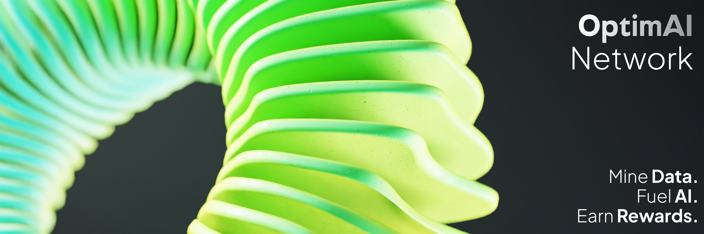

# Welcome to OptimAI Network

:::tip[**What is OptimAI Network?**]
**OptimAI Network** is a **decentralized Reinforcement Data Network** that seamlessly integrates an **EVM Layer-2 blockchain, DePIN (Decentralized Physical Infrastructure Network), and a community-driven data mining and validation framework** to revolutionize the learning process of AI Agents. By leveraging a decentralized network of contributors, OptimAI enables real-time **data collection, validation, and reinforcement learning**, ensuring AI models evolve continuously with **high-quality, diverse, and contextually rich datasets**.

This **scalable, self-improving AI ecosystem** guarantees AI Agents become more **intelligent, autonomous, and responsive**, making them **faster, more accurate, and seamlessly adaptive** to real-world scenarios.
:::

## Why OptimAI Network?
Traditional AI training is constrained by data scarcity, centralized control, and outdated validation mechanisms. OptimAI Network addresses these challenges by:

- **Decentralizing Data Access:** Shifting control from monopolized entities to a community-driven model, ensuring fair and open AI development.
- **Enhancing Data Mining & Validation:** Using reinforcement learning principles, community participation, and on-device computation to mine, clean, and structure datasets dynamically.
- **Leveraging DePIN & Layer-2 Blockchain:** Enabling secure, high-speed, and cost-efficient transactions within the AI data ecosystem.
- **Empowering AI Agents:** Supporting the autonomous creation and development of AI agents that operate contextually within user environments.

## Unique Features of OptimAI Network
### 1. Built-in Browser Nodes: Intuitive Data Mining
OptimAI introduces a revolutionary approach to data mining by embedding built-in browser within a DePIN node, enabling users to contribute data effortlessly while maintaining control over privacy.

- **Seamless Background Data Collection:** Nodes operate within everyday browsing sessions, allowing passive yet impactful participation in AI training.
- **Access to Authenticated Platforms:** Supports data retrieval from closed ecosystems (e.g., Twitter, Facebook, and other authenticated platforms) with user consent.
- **Privacy-Preserving Architecture:** Local data processing ensures compliance with GDPR, CCPA, and other regulatory frameworks, sharing only anonymized insights.

### 2. Multi-Layered Data Processing & Validation
To ensure AI models are trained on high-quality datasets, OptimAI Network implements a multi-faceted approach to data handling:

- **Diverse Data Sourcing**: Aggregates structured and unstructured data from public domains, user interactions, and curated repositories.
- **Automated Cleaning & Validation Pipelines**: Utilizes AI-driven algorithms and human-in-the-loop verification for continuous dataset refinement.
- **Scalability & Efficiency**: OptimAI’s architecture supports massive data ingestion while reducing redundancy and optimizing storage across nodes.

### 3. Layer-2 DePIN Blockchain: OptimAI OP-Stack
OptimAI Network operates on an advanced Layer-2 blockchain infrastructure, enhancing scalability, security, and transaction efficiency within its decentralized AI ecosystem.

- **Optimized for High-Throughput AI Transactions**: Enables micro-transactions, incentivized data sharing, and real-time model training without network congestion.
- **Decentralized Governance & Transparency**: Community stakeholders influence network upgrades and data policies via smart contract voting mechanisms.
- **Lower Fees, Higher Security**: Layer-2 rollups ensure cost-effective transactions while inheriting Ethereum’s robust security framework.

### 4. OptimAI Agent OS
OptimAI offers an innovative AI Agent Operating System (OS) that enables users to develop and deploy personalized AI agents:

- **User-Centric AI**: Agents adapt to individual user preferences, automating tasks based on real-time contextual data.
- **Edge Computing Integration**: AI models process data on user devices, minimizing latency and enhancing efficiency.
- **Agent Marketplace**: Developers can create, distribute, and monetize AI agents tailored to various applications.

### 5. OptimAI SDK: Developer Empowerment
For developers and enterprises looking to leverage OptimAI’s data and AI infrastructure, the OptimAI SDK provides tools and incentives:

- **Custom Data Collection APIs**: Offers tailored data pipelines that integrate seamlessly with OptimAI’s decentralized framework.
- **Incentivized AI Innovation**: Developers earn OPI tokens for creating specialized data-mining strategies or AI agent enhancements.
- **Modular & Interoperable**: Built for adaptability across diverse AI models, blockchain integrations, and enterprise applications.

### 6. Privacy-Centric and Ethical Design
OptimAI upholds a strong commitment to ethical AI development and user privacy:

- **Privacy-Preserving AI Training**: Employs federated learning techniques to process data locally on devices while still refining global AI models.
- **Transparent & Bias-Resistant AI**: Uses community-driven validation protocols to mitigate biases in AI decision-making.
- **Regulatory Compliance**: Adheres to international data protection standards (GDPR, CCPA, etc.), fostering trust and security within the ecosystem.