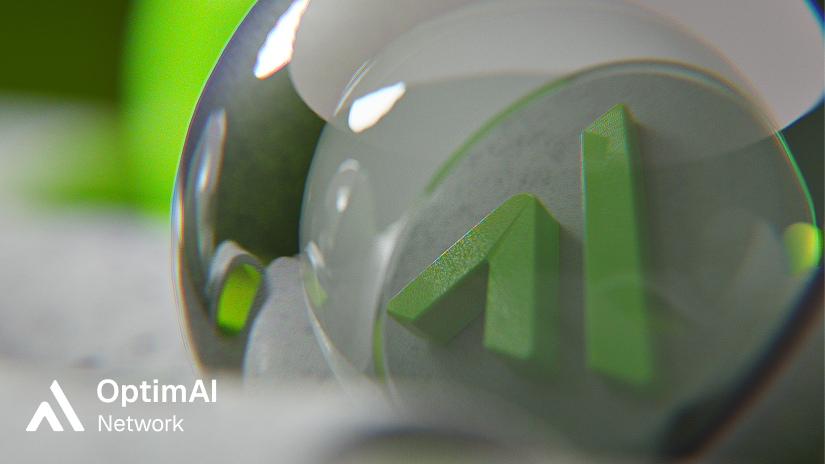
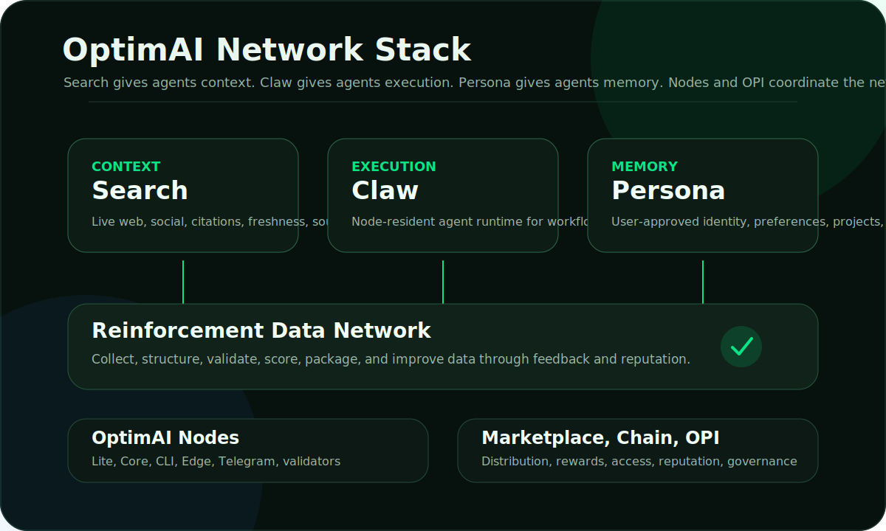

# Welcome to OptimAI Network

**OptimAI Network is the Infrastructure for the Agent-native Internet**: a decentralized system for live context, agent execution, user-owned memory, data validation, and contributor rewards.

The product model is straightforward:

- **Search** gives agents current, source-backed context.
- **Claw** gives agents a runtime for research, extraction, monitoring, and workflow execution.
- **Persona** gives agents user-approved memory and identity.
- **Nodes** provide the distributed data, compute, bandwidth, and validation layer.
- **Marketplace, Chain, and OPI** coordinate distribution, payments, rewards, reputation, and governance.

## Why OptimAI Exists

AI agents need more than a model. They need fresh data, trustworthy sources, persistent memory, and a way to act across real workflows. OptimAI connects those requirements into one network.

Instead of treating AI as a single app, OptimAI treats intelligence as a stack:

| Layer | Role |
| --- | --- |
| **Context** | Search retrieves current information with citations and source signals. |
| **Execution** | Claw runs tasks from the Core Node environment. |
| **Memory** | Persona stores user-approved preferences, projects, sources, and decisions. |
| **Trust** | The Reinforcement Data Network validates data and records provenance. |
| **Infrastructure** | Lite, Core, CLI, Edge, and Telegram nodes contribute useful work. |
| **Coordination** | OPI, marketplace primitives, and OptimAI Chain align usage and contribution. |

## What You Can Build Or Use

### For users

- Search the web and social context with OptimAI Search.
- Run Claw workflows for research, extraction, monitoring, and reporting.
- Build a Persona that remembers approved context and preferences.
- Run a node and participate in the network.

### For builders

- Add OptimAI Search to agents through MCP.
- Use x402 SDK flows for paid, agent-native search.
- Design Claw extraction and workflow jobs.
- Build products around source-backed intelligence and reusable datasets.

### For node operators

- Run Lite Node for low-friction participation.
- Run Core Node or CLI Node for advanced workloads.
- Use Edge Node for mobile participation.
- Build reliability and reputation through accepted work.

## Read This First

| If you want to understand... | Start here |
| --- | --- |
| The system thesis | [Introduction](./overview/intro.md) |
| The market problem | [The Problem](./overview/problem.md) |
| The product solution | [The OptimAI Solution](./overview/solution.md) |
| How the network fits together | [Architecture](./architecture.mdx) |
| How to build | [Developer Get Started](./builders/get-started.mdx) |
| How to run a node | [What is OptimAI Node?](./optimai-node/node-intro.md) |

## Documentation Notes

Some API, Claw, Persona, campaign, and marketplace interfaces are documented as preview contracts. They explain intended product architecture and builder experience, but production fields should be verified against official releases before integration.
