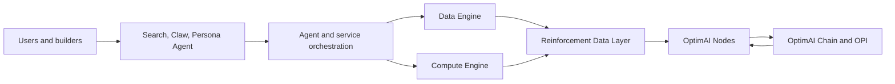
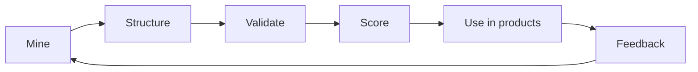

import 'katex/dist/katex.min.css'

# OptimAI Network Litepaper

**Decentralized intelligence for the agentic web.**

---

## Abstract

OptimAI Network is a decentralized AI intelligence network that combines browser-native nodes, DePIN compute, human validation, reinforcement data pipelines, OptimAI Chain, and the OPI token economy.

The network powers a growing product suite:

- **OptimAI Search:** AI-native Web3 search with live sources and citations.
- **OptimAI Claw:** structured extraction and intelligence capture from web, social, documents, and workflows.
- **OptimAI Persona Agent:** a user-owned personal AI layer with memory, tools, and permissioned context.

OptimAI’s thesis is simple: the next generation of AI agents will be limited not by model access alone, but by the quality, freshness, provenance, and ownership of their data. OptimAI builds the decentralized supply chain for that intelligence.

---

## 1. The Problem

AI is becoming agentic. It can search, plan, write, extract, compare, and automate. But most AI systems still depend on centralized indexes, static datasets, closed APIs, and incomplete context.

This creates five major constraints:

1. **Freshness:** models and datasets lag behind the live internet.
2. **Access:** high-value context often lives inside dynamic interfaces, social systems, logged-in tools, or workflows.
3. **Trust:** agents need provenance, source quality, and validation, not only generated text.
4. **Personalization:** personal agents need user-owned memory and permissioned context.
5. **Ownership:** the people who create useful data and feedback rarely participate in the value it creates.

---

## 2. The OptimAI Solution

OptimAI creates a decentralized intelligence stack with three connected layers.

### Network Layer

Lite, Core, and Edge Nodes contribute data, bandwidth, compute, storage, validation, and edge context. Core Nodes add integrated browser capabilities for deeper web and workflow intelligence.

### Reinforcement Data Layer

Raw inputs are mined, cleaned, structured, embedded, validated, scored, and improved through human feedback. The layer tracks provenance, freshness, quality, and reputation.

### Product Layer

OptimAI products make the network useful:

- Search answers questions using live, source-backed retrieval.
- Claw extracts structured intelligence from messy digital surfaces.
- Persona Agent remembers user context and acts across workflows.

---

## 3. Network Architecture

### OptimAI Nodes

- **Lite Node:** lightweight participation through browser extension and Telegram.
- **Core Node:** advanced desktop/CLI node for browser, extraction, compute, storage, and campaign workloads.
- **Edge Node:** mobile and future IoT node for local, contextual, and edge participation.

### OptimAI Chain

OptimAI Chain coordinates rewards, service fees, reputation, staking, campaign settlement, marketplace transactions, and governance.

### OPI Token

OPI aligns contribution and usage across the ecosystem. It rewards useful network work and supports payments for services such as Search, Claw, Persona Agent, APIs, campaigns, and marketplace activity.

---

## 4. Reinforcement Data

OptimAI’s core innovation is the reinforcement data loop.

### Data Sources

- public web
- social and community platforms
- documents and knowledge bases
- extraction campaigns
- permissioned browser sessions
- mobile and edge contexts
- human validation and feedback

### Quality Signals

- provenance
- timestamp and freshness
- source reputation
- node reputation
- validator consensus
- duplication and anomaly checks
- user feedback
- downstream product usefulness

---

## 5. Product Suite

### OptimAI Search

OptimAI Search is the network’s first broad user product. It retrieves current sources, applies semantic ranking and reinforcement scoring, then synthesizes useful answers with citations and visual context.

### OptimAI Claw

OptimAI Claw is the extraction layer. It can transform websites, documents, social surfaces, feeds, and workflows into structured data for datasets, dashboards, agents, and APIs.

### OptimAI Persona Agent

Persona Agent is the personal AI layer. It learns from permissioned user context, saves useful memory, calls Search and Claw as tools, and helps users complete personalized research and automation tasks.

---

## 6. Economic Model

OptimAI creates demand for OPI through useful network services.

### Contributors earn by providing:

- data mining
- Claw extraction results
- validation and annotation
- bandwidth
- compute
- storage
- uptime
- human feedback
- campaign completion

### Users and builders spend OPI for:

- premium search and APIs
- extraction jobs
- data campaigns
- Persona Agent capabilities
- marketplace services
- compute workloads
- staking and governance

Reward models should evolve toward quality-weighted contribution. A simplified reward signal can be represented as:

$$
R_i = \alpha(Q_i + V_i + C_i + U_i)
$$

Where:

- $Q_i$ is contribution quality.
- $V_i$ is validation accuracy.
- $C_i$ is compute, bandwidth, or storage contribution.
- $U_i$ is observed usefulness or campaign demand.
- $\alpha$ is a dynamic scaling factor based on network conditions.

---

## 7. Network Flywheel

OptimAI is designed around compounding network effects:

1. More users run nodes.
2. More nodes increase data coverage and compute capacity.
3. Better data improves Search, Claw, and Persona Agent.
4. Better products create more demand.
5. More demand increases rewards and builder activity.
6. More builders create more agents, campaigns, and services.

---

## 8. Roadmap Themes

- Expand Lite, Core, and Edge Node adoption.
- Improve data validation, provenance, and reputation.
- Scale OptimAI Search as the first mass-market intelligence product.
- Build OptimAI Claw into the programmable extraction layer.
- Launch Persona Agent as the user-owned personal AI layer.
- Expand OPI utility across services and marketplace demand.
- Open APIs and SDKs for builders.
- Grow the OptimAI ecosystem into decentralized intelligence as a service.

---

## Conclusion

OptimAI Network is building the missing data and coordination layer for AI agents.

The internet is becoming programmable through agents. Those agents need fresh context, trusted data, structured extraction, personal memory, decentralized compute, and aligned incentives. OptimAI brings these pieces into one network and one product ecosystem.

**Mine data. Fuel AI. Build the agentic web.**
