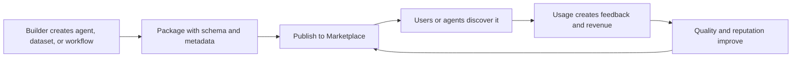

# OptimAI Marketplace

OptimAI Marketplace is the distribution layer for the agent-native stack. If Search provides context, Claw provides execution, and Persona provides memory, Marketplace is where useful intelligence can be packaged, discovered, reused, and paid for.

## What Marketplace Is For

| Asset | Example |
| --- | --- |
| **Agents** | research analyst, product monitor, trading assistant, creator strategist |
| **Workflows** | weekly market brief, pricing monitor, lead research, compliance watch |
| **Datasets** | validated company lists, social trend datasets, protocol maps, source indexes |
| **Services** | extraction jobs, validation tasks, compute-backed processing, premium context |
| **Prompts and tools** | reusable task templates, tool configurations, agent skills |

## Why It Matters

The value of an agent is not only in a single prompt. It is in reusable expertise:

- the sources it knows to check
- the fields it extracts
- the workflow it follows
- the way it validates output
- the memory and preferences it uses
- the reputation it builds over time

Marketplace turns that expertise into a network asset.

## Marketplace Loop

## Relationship To OPI

OPI can support marketplace activity through:

- payments for agents, datasets, workflows, and services
- campaign budgets
- creator rewards
- staking or reputation mechanics
- governance over marketplace policy

## Status

Marketplace should be treated as an ecosystem track. The docs describe the intended role and design principles; production availability, fees, listing rules, and creator economics should be confirmed before launch.

## Design Principles

- Every listing should explain what it does and what data it uses.
- Agent and workflow listings should show permissions clearly.
- Datasets should include provenance and validation metadata.
- Paid services should expose pricing and expected output.
- Reputation should reflect accepted work, user feedback, and reliability.
