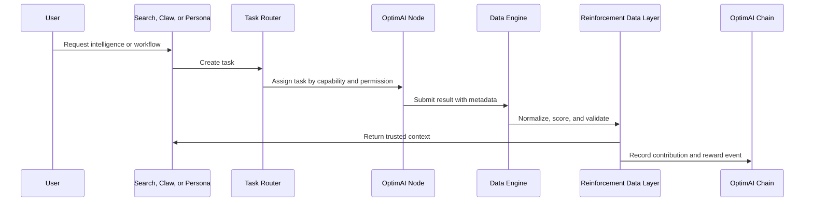

# Network Operations

This page explains how OptimAI Network moves from user activity to validated intelligence and rewards. It is written for readers who want the mechanics without the pitch.

## Operational Model

OptimAI has four operational loops:

1. **Task demand:** A product, user, builder, or campaign requests search, extraction, validation, compute, or monitoring.
2. **Node execution:** Eligible nodes receive tasks based on capability, reputation, availability, and permissions.
3. **Reinforcement validation:** Results are checked for provenance, freshness, accuracy, duplication, and usefulness.
4. **Settlement:** Contributions update node reputation and reward status.

## Data Flow

## Node Roles

| Role | Typical work |
| --- | --- |
| **Lite Node** | Lightweight validation, bandwidth contribution, referrals, and simple data tasks. |
| **Core Node** | Browser-native execution, Claw runtime, extraction, compute, storage, and campaign jobs. |
| **Edge Node** | Mobile participation, local context, edge preprocessing, and future IoT workflows. |
| **Validators** | Review samples, label data, confirm relevance, and provide human feedback. |

## Task Types

- **Search refresh:** gather or refresh sources for a query.
- **Claw extraction:** extract structured data from approved sources.
- **Validation:** review data quality, source relevance, or extracted records.
- **Annotation:** label text, images, entities, sentiment, or categories.
- **Compute:** run preprocessing, embeddings, inference support, or dataset processing.
- **Monitoring:** repeat a query or extraction job over time.

## Privacy And Security Principles

OptimAI should be clear about user control. The strongest documentation does not hide behind vague words like “secure”; it explains the model.

- **Permission first:** authenticated or personal sources require user approval.
- **Local processing where possible:** sensitive raw context should stay on the device when workflows allow.
- **Anonymization:** network-submitted outputs should avoid personal identifiers unless the user explicitly chooses otherwise.
- **Encryption:** node communication should be encrypted in transit.
- **Resource controls:** users should be able to set limits for bandwidth, compute, storage, and task types.
- **Auditability:** valuable outputs should include source metadata and task history.

## Quality Controls

OptimAI’s data quality model should combine automated checks and human judgment:

- duplicate detection
- source reputation
- freshness scoring
- validator agreement
- node reputation
- anomaly detection
- user feedback
- downstream product usefulness

## Reward Inputs

Reward calculations should be quality-weighted. Useful inputs include:

- task difficulty
- result quality
- validation accuracy
- uptime and reliability
- compute or bandwidth contributed
- campaign demand
- reputation history

## What To Verify Before Launching A Task

- Does the task require user permission?
- Is the expected output schema clear?
- Does the task need validation?
- What data can be shared with the network?
- What reward budget or fee applies?
- How will the result be used by Search, Claw, Persona, or an API?
