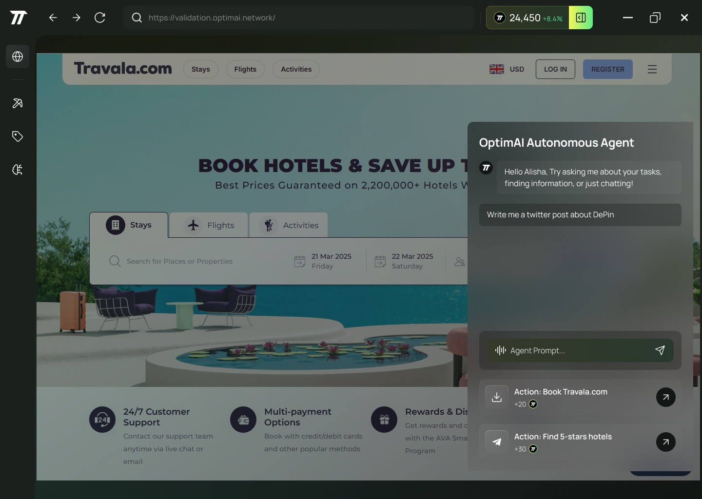

# OptimAI Agents: Unleashing Autonomous AI for Everyone

:::tip[Key Features]
- **Self-Running AI:** OptimAI Agents work independently, tackling any task you throw their way.
- **Data Freedom:** They pull from a vast, decentralized pool of global data sources, mining from public to even authenticated platforms.
- **Prompt Magic:** Build your own agent with a single sentence—no tech degree needed.
- **People-Powered:** A worldwide community shapes these agents, making them affordable and trustworthy.
:::

---

## Welcome to the World of OptimAI Agents
Imagine an AI that doesn’t just follow orders but thinks for itself, fetching whatever data it needs to get the job done. That’s an **OptimAI Agent**, a creation of the **OptimAI Network**—a decentralized powerhouse where data flows freely and anyone can craft their own AI with a simple prompt. Whether you’re a student, a startup, or just curious, this is AI made for *you*.

### The Old Way: Where AI Hits a Wall
Traditional AI development is stuck in a rut:
- **Locked Data:** Big companies hoard it, leaving the rest of us begging for scraps.
- **Pricey Overhead:** Storage, computing, and delivery costs pile up fast.
- **Hidden Secrets:** Closed systems mean you can’t trust what’s under the hood.

These roadblocks keep AI exclusive, expensive, and sometimes unethical. Innovation suffers, and most people are left out.

### The OptimAI Fix: A Game-Changer
The OptimAI Network flips the script:
- **Open Data Network:** Blockchain-backed, community-driven data from everywhere.
- **Cheap and Cheerful:** Shared nodes slash costs to pennies.
- **Prompt Power:** Say what you want, and the network builds it for you.

---

## How OptimAI Agents Come to Life

The secret sauce is a two-layer system that’s as seamless as it is brilliant:

| **Layer**                   | **What It Does**                           | **How It Works**                                                                          |
|-----------------------------|--------------------------------------------|------------------------------------------------------------------------------------------|
| **Infrastructure Layer**     | The muscle behind the operation           | - **Edge Compute:** Fast local processing  
|                             |                                            | - **Federated Learning:** Private, distributed training  
|                             |                                            | - **Decentralized Storage:** Data safe and sound worldwide  
|                             |                                            | - **Dynamic Bandwidth:** Speedy data flow  
| **Reinforcement Data Layer** | The brain that keeps agents sharp         | - **Data Mining:** Digs up insights  
|                             |                                            | - **Data Annotation:** Labels it right  
|                             |                                            | - **Data Validation:** Keeps it honest  
|                             |                                            | - **RLHF:** Tunes it with human wisdom  

### Crafting Your Agent: As Easy as 1-2-3
1. **Drop a Prompt:** Try "Make an AI to plan my weekly meals."
2. **Network Does the Heavy Lifting:** It scours data, refines it, and trains your agent.
3. **Meet Your Agent:** A fully autonomous helper, ready to roll and evolve.

No coding, no fuss—just a sentence, and you’ve got a custom AI.

---

## Why This Matters
- **Anyone Can Play:** From kids to CEOs, building AI is now a breeze.
- **Built on Trust:** Transparency and community feedback mean no shady surprises.
- **Endless Possibilities:** Agents grow smarter as the network thrives.

Think of a teacher prompting, "Create an AI to grade essays," and getting a reliable assistant overnight—cheap, fair, and open for all to improve.

---

## The Future Is Now
OptimAI Agents aren’t just AI—they’re a movement. With decentralized data and prompt engineering, the OptimAI Network hands you the keys to create, own, and evolve AI that’s autonomous, ethical, and accessible. This isn’t tech for the few; it’s tech for the world.

**Dive In:** [OptimAI Network Data Network Overview](https://optimai.network/data-network)