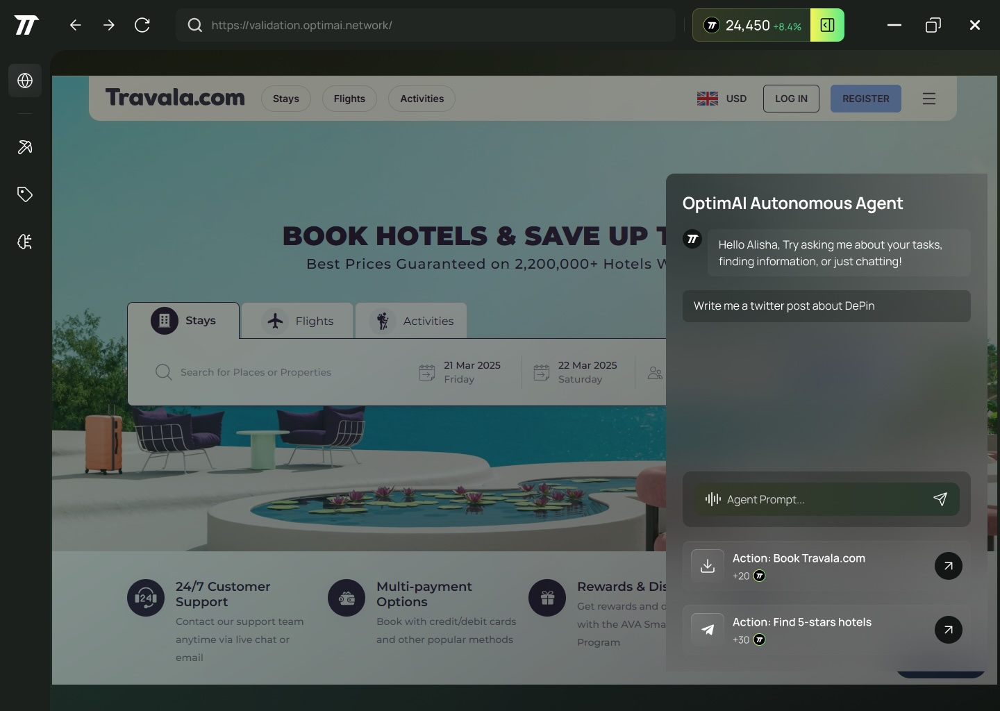
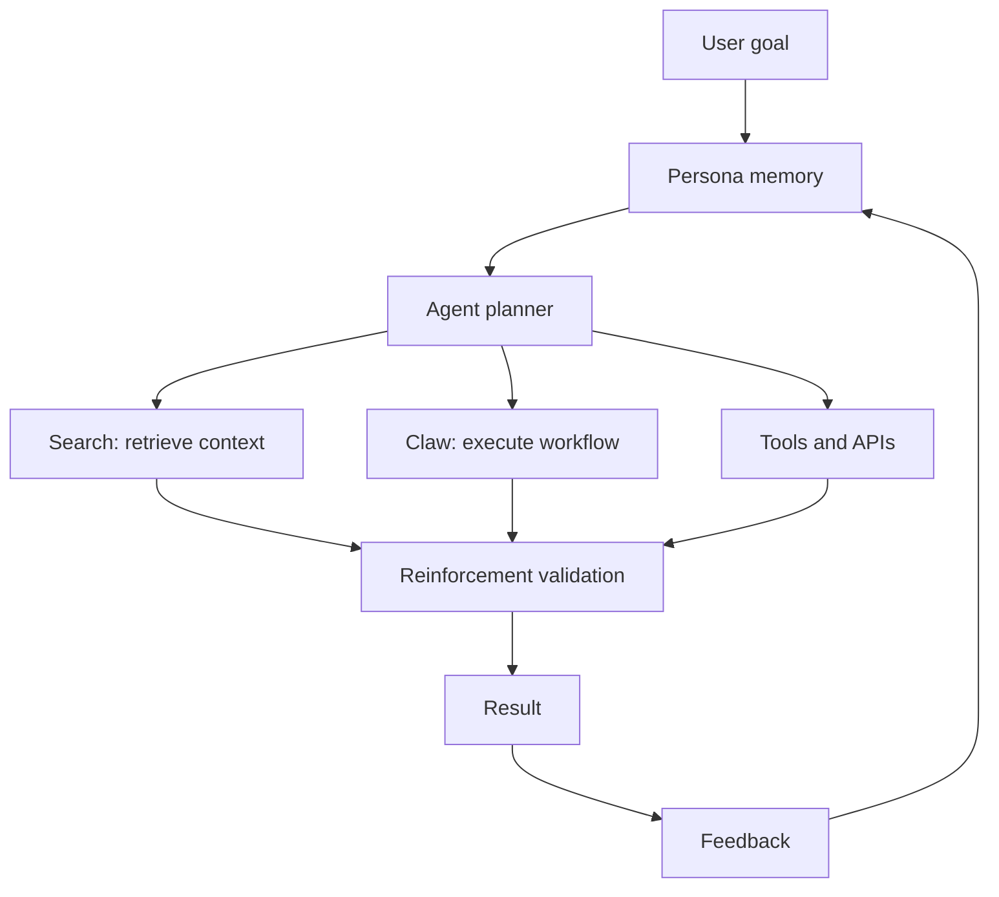

# OptimAI Agent Platform

OptimAI’s agent platform is the composition of three product primitives:

- **Search** gives agents context.
- **Claw** gives agents execution.
- **Persona** gives agents memory and identity.

The node network, reinforcement data layer, and OPI economy make those primitives useful beyond a single app session.

## Agent Stack

```mermaid
flowchart TB
  A["User goal"] --> B["Persona memory"]
  B --> C["Agent planner"]
  C --> D["Search: retrieve context"]
  C --> E["Claw: execute workflow"]
  C --> F["Tools and APIs"]
  D --> G["Reinforcement validation"]
  E --> G
  F --> G
  G --> H["Result"]
  H --> I["Feedback"]
  I --> B
```

## Core Agent Types

| Agent type | What it does | Uses |
| --- | --- | --- |
| **Personal agent** | Maintains user-approved preferences, projects, and recurring workflows. | Persona, Search, Claw |
| **Research agent** | Gathers current context and produces source-backed briefs. | Search, Claw |
| **Workflow agent** | Executes repeated tasks such as monitoring, comparison, and reporting. | Claw, Persona |
| **Data agent** | Creates, refreshes, validates, or packages datasets. | Claw, Data Engine, campaigns |
| **Marketplace agent** | A reusable specialist that can be published, discovered, and paid for. | Persona, marketplace, OPI |

## Why OptimAI Agents Are Different

### They are grounded in live context

Agents can use OptimAI Search and the data network instead of relying only on model memory.

### They can operate, not only answer

Claw gives agents a runtime for extraction, task execution, and workflow completion from inside the Core Node environment.

### They can retain user-approved memory

Persona helps agents preserve preferences, source lists, project context, and workflow decisions over time.

### They can become network assets

Marketplace and OPI primitives create a path for specialized agents, datasets, and workflows to be packaged, reused, and monetized.

## Example Flow

1. A user asks for a market brief.
2. Persona loads the user’s preferred format and watchlist.
3. Search gathers current sources.
4. Claw extracts companies, claims, dates, and links.
5. The data layer validates and scores records.
6. The agent returns a cited brief and saves approved memory.

## Builder Interfaces

Builders can start with:

- [Search MCP and API patterns](./builders/api-overview.mdx)
- [SDK Quickstart](./builders/sdk-quickstart.mdx)
- [Builder Workflows](./builders/workflows.mdx)
- [Data Schemas](./builders/schemas.mdx)
