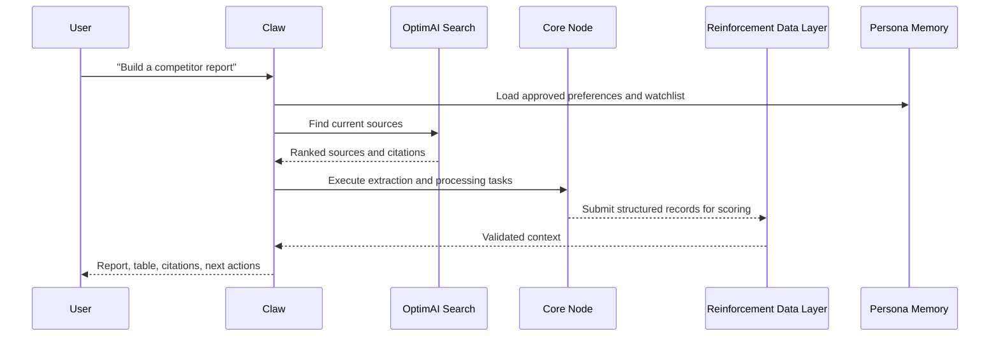

# OptimAI Claw

**OptimAI Claw is the native agent runtime inside OptimAI Core Node.** It gives users a persistent local agent that can research, extract, summarize, and execute multi-step workflows from a single instruction.

Claw is not just a chat interface. It is the part of OptimAI that moves from “answering” to “operating”: planning a task, gathering context, using tools, extracting structured data, and returning a result the user can inspect.

:::tip[Product role]
Claw is the operator layer. Search finds context, the Reinforcement Data Network verifies it, Persona stores user-approved memory, and Claw turns those capabilities into action.
:::

## What Claw Does

| Capability | Description |
| --- | --- |
| **Multi-step execution** | Breaks a user goal into smaller actions such as search, extraction, comparison, drafting, and reporting. |
| **Local runtime** | Runs from the user’s Core Node environment so workflows can stay closer to the user’s device and permissions. |
| **Web and social research** | Uses OptimAI Search and node-powered retrieval to gather current information. |
| **Structured extraction** | Turns web pages, documents, feeds, and workflows into structured records. |
| **Agent memory** | Works with Persona Agent to reuse user-approved preferences, projects, and context. |
| **Feedback loop** | Learns from corrections, approvals, and repeated workflows. |

## Position In The Stack

| Layer | Claw relationship |
| --- | --- |
| **Search** | Retrieves the sources Claw needs before it executes a workflow. |
| **Persona** | Supplies approved user context, format preferences, and watchlists. |
| **Nodes** | Provide the Core Node runtime and execution environment. |
| **Reinforcement Data Network** | Scores extracted records, provenance, and workflow outputs. |
| **Marketplace** | Can package reusable Claw workflows, datasets, and agent services. |

## Operating Contract

A Claw workflow should produce an inspectable result. That means:

- clear input goal
- visible source list when sources are used
- structured output when extraction is requested
- provenance for important claims or records
- user approval before saving memory
- explicit permission for personal or authenticated sources
- repeatable workflow definition for recurring tasks

## How It Works



## Example Prompts

```text
Claw, compare the latest AI agent platforms and summarize their positioning, pricing, and traction.
```

```text
Claw, monitor these five competitors and prepare a weekly brief with product launches, funding news, and social narratives.
```

```text
Claw, extract all pricing plans from this page, normalize the features, and return a comparison table with source links.
```

```text
Claw, turn this research thread into a structured dataset I can reuse in a market map.
```

## Common Workflows

### Market Research

Claw gathers sources, extracts entities, groups findings, and produces a cited brief. This is useful for founder research, investor memos, competitor tracking, and ecosystem mapping.

### Lead Generation

Claw can collect company information from approved sources, normalize fields, and prepare a list for review. The workflow should keep contact sourcing, enrichment, and outreach permission-aware.

### Content Strategy

Claw can scan current conversations, identify recurring questions, and draft article outlines or social content ideas with links back to the source material.

### Operations And Reporting

Claw can turn repeated workflows into repeatable routines: weekly reports, status digests, product monitoring, or structured summaries from internal documents where permission is granted.

## When To Use Claw

Use Claw when the task requires more than retrieval:

- extracting fields from sources
- comparing changes over time
- turning research into a structured report
- monitoring a list of sources
- applying Persona memory to a repeated workflow
- preparing reusable datasets or marketplace-ready workflows

## Claw And Data Extraction

Extraction is one of Claw’s strongest modes, but it is not the whole product.

Claw extraction jobs can produce:

- structured tables
- entity lists
- pricing matrices
- citation-backed claims
- source summaries
- dataset records
- monitoring feeds

For implementation-shaped examples, see the [Claw API preview](./builders/api-overview.mdx#claw-api), [SDK Quickstart](./builders/sdk-quickstart.mdx#preview-claw-extraction-pattern), and [Claw record schema](./builders/schemas.mdx#claw-record).

## Privacy Model

Claw should be explicit about what it can access and what it can share.

- The user approves connected sources and workflows.
- Sensitive context should be processed locally where possible.
- Outputs shared with the network should be anonymized or structured to avoid personal data leakage.
- Persona memories should be private by default unless the user chooses to share them.
- High-value extracted data should carry provenance and validation signals.

## Why It Matters

The next step in AI is not a better prompt box. It is software that can work through a task with context, tools, memory, and verification. Claw is OptimAI’s path to that agentic layer.
