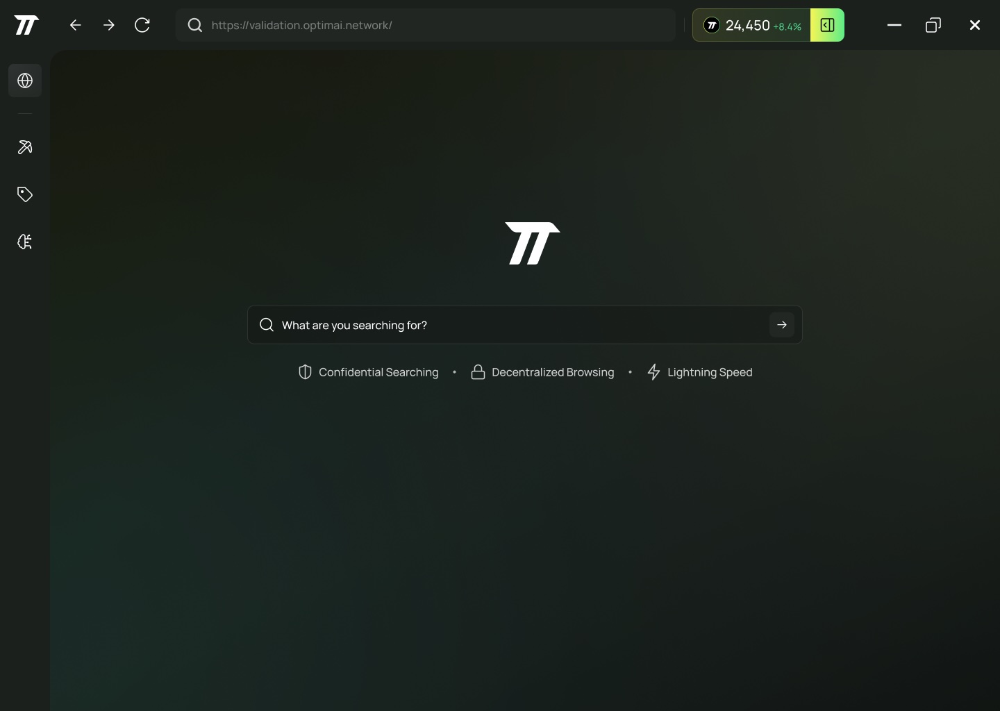

# OptimAI Core Node

Core Node is the high-capacity OptimAI client. It is built for operators who want to run deeper network workloads: Claw execution, browser-native tasks, extraction jobs, compute, storage, validation, and campaigns.



## What Core Node Enables

| Capability | Description |
| --- | --- |
| **Claw runtime** | Run node-resident agent workflows for research, extraction, and execution. |
| **Browser-native tasks** | Process dynamic web contexts and approved browser workflows. |
| **Extraction jobs** | Turn sources into structured records with provenance. |
| **Compute tasks** | Support preprocessing, embeddings, validation, and future inference workloads. |
| **Campaign execution** | Participate in targeted network jobs with explicit objectives and reward budgets. |
| **Node reputation** | Build reliability through uptime, accepted results, and validation quality. |

## Requirements

- RAM: 4 GB minimum, 8 GB recommended.
- CPU: 2 cores or more.
- Disk: 15 GB free space.
- OS: Windows 10/11, macOS 12+ on Intel or Apple Silicon, or Ubuntu 22.04+.
- Docker: Docker Desktop on Windows/macOS or Docker Engine on Linux.
- Account: OptimAI account.
- Network: active internet connection.

:::info[Docker]
Core Node workloads require Docker to be installed and running before you start the node.
:::

## Desktop App

Use the Desktop App if you prefer a visual interface for node status, rewards, and participation.

1. Download the installer:
   - [Windows](https://optimai.network/download/core-node/win)
   - [macOS](https://optimai.network/download/core-node/mac)
   - [Ubuntu Linux](https://optimai.network/download/core-node/linux)
2. Install and launch the app.
3. Sign in with your OptimAI account.
4. Start the node after Docker is running.

## CLI Node

Use the CLI for servers, headless environments, or advanced operators.

### macOS

```bash
curl -L https://cli-node.optimai.network/optimai_cli_darwin_universal2 -o optimai-cli
chmod +x optimai-cli
sudo mv optimai-cli /usr/local/bin/optimai-cli
```

### Ubuntu Linux

```bash
curl -L https://cli-node.optimai.network/optimai_cli_ubuntu -o optimai-cli
chmod +x optimai-cli
sudo mv optimai-cli /usr/local/bin/optimai-cli
```

### Windows

```powershell
curl.exe -L https://cli-node.optimai.network/optimai_cli_windows.exe -o optimai-cli.exe
.\optimai-cli.exe --help
```

## Run The CLI

Sign in:

```bash
optimai-cli auth login
```

Start the node:

```bash
optimai-cli node start
```

Check status:

```bash
optimai-cli node status
```

View rewards:

```bash
optimai-cli rewards balance
```

Update the CLI:

```bash
optimai-cli update
```

Stop the node by pressing `Ctrl+C` in the terminal where it is running.

## Background Operation

On Linux or macOS, use a terminal session manager if you want the node to keep running after you disconnect.

```bash
screen -S optimai
optimai-cli node start
```

Detach with `Ctrl+A`, then `D`. Resume later with:

```bash
screen -r optimai
```

## Operator Guidance

- Keep Docker running before starting the node.
- Keep the node updated.
- Use stable connectivity.
- Review permissions before running authenticated or personal workflows.
- Monitor status and reward balance regularly.
- Use Core Node when you want to run Claw or advanced network tasks.

## Troubleshooting

| Issue | What to check |
| --- | --- |
| Browser login fails | Try `optimai-cli auth login --legacy`. |
| Docker not running | Start Docker Desktop or Docker Engine, then retry. |
| Node already running | Run `optimai-cli node status` to check the active process. |
| Rewards not visible | Confirm you are signed in with the expected account and that tasks have been accepted. |
