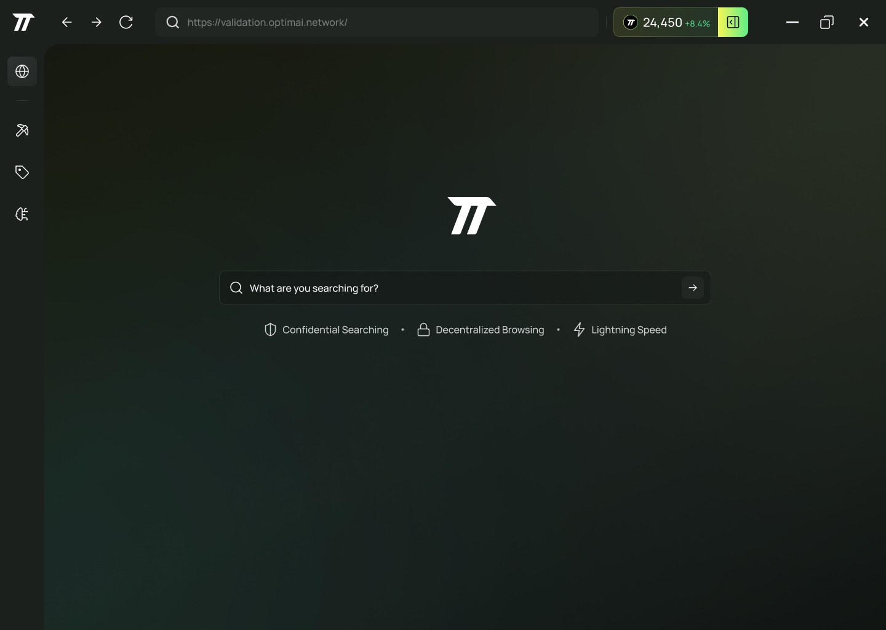

# OptimAI Core Node

:::tip[Overview]
The **OptimAI Core Node** is the most comprehensive option for engaging with the OptimAI Network. It supports all available tasks and features, making it perfect for users who want to dive deep into the network’s capabilities. This node is designed for flexibility and power, catering to both general users and developers.
:::

## Installation (Coming soon)

The OptimAI Core Node can be installed as a desktop application or accessed via a command-line interface (CLI). Choose the option that suits your needs.

## Available Tasks

The OptimAI Core Node unlocks a wide range of tasks for users to contribute to the network:

- **DePIN Tasks:** Participate in decentralized physical infrastructure network (DePIN) activities, supporting the backbone of the OptimAI ecosystem.
- **Data Tasks:** Engage in data-related activities, including collection, validation, and processing, to enhance the network’s data capabilities.

## Supported Platforms

- **Desktop App:** Compatible with Windows 10+, MacOS 12+, and Ubuntu 20+.
- **CLI:** Available for developers on the supported operating systems listed above.

---

## OptimAI Core Node: The Power of Built-in Browser in OptimAI DePIN Nodes
At the heart of the OptimAI Network lies our revolutionary **Integrated Browser Node**—a fusion of a node and a built-in web browser designed to seamlessly support the **autonomous AI Agent revolution**. This integration transforms the way data is gathered, utilized, and continuously fed into AI models, paving the way for **truly self-improving AI systems accessible to everyone**.

Unlike traditional methods of AI training, which rely on **static datasets and centralized data control**, the **OptimAI Browser Node** enables **real-time, dynamic, and contextually rich data streams** that can adapt **as users interact with the digital world**. By **eliminating barriers to high-quality, real-world data**, this technology accelerates AI development, **making personalized, autonomous AI Agents a reality**.

## Overcoming the Limitations of Traditional Data Scraping
In traditional DePIN networks, nodes receive tasks with URLs to crawl public websites like CNN, Bloomberg, Wikipedia, and YouTube, scraping as much data as possible from accessible sources. While this method collects raw data from public domains, it has significant limitations:

- **Access Restriction:** Limited to publicly available data, missing out on valuable information behind authentication walls. 
- **Lack of Behavioural Insights:** Does not capture **user interactions, engagement patterns, or decision-making processes**, which are crucial for advanced AI models.
- **Sequential Data Gaps:** Fails to collect **multi-step user actions and decision pathways**, which are necessary for training AI to perform **complex, multi-step tasks with real-world utility**.

## Unlocking Access to Closed-Source Data with Privacy-Preserving Methods
Unlike traditional scraping models, **OptimAI Browser Nodes operate directly within user sessions**, allowing the **responsible and secure collection of valuable, real-world interaction data** without compromising user privacy. By utilizing **on-device processing, encryption, and anonymization**, OptimAI ensures that data remains **private, ethical, and compliant with regulations like GDPR and CCPA** while unlocking insights from:

- **Social Media:** Facebook, Twitter (X), Discord, LinkedIn, Reddit, and more.
- **Private Channels:** Messaging apps, private forums, Discord servers, and community groups.
- **Subscription Services:** News outlets, academic journals, and specialized paywalled databases.

With this **groundbreaking approach**, OptimAI **creates a new paradigm for AI training**, where AI Agents are not limited by outdated, incomplete datasets but are **continuously improving based on human-like learning from real-world interactions**.

## Capturing User Behaviour and Sequential Data for Next-Gen AI Agents
To build **truly autonomous AI Agents**, capturing **context, intent, and sequential interactions** is crucial. The OptimAI Browser Node enables:

- **Deep Context Awareness:** AI Agents **observe, process, and learn from real-world digital behaviors**, ensuring they understand **why** actions are taken, not just **what** actions are taken.
- **Predictive Learning & Assistance:** By analyzing **patterns of user behavior**, AI Agents **anticipate actions, suggest improvements, and automate complex workflows**.
- **Personalized Adaptation & Evolution:** Unlike static AI models, **OptimAI AI Agents evolve over time**, learning from real-time user interactions to **offer hyper-personalized responses and decision-making support**.

## The Breakthrough to True Autonomous AI Agents
The **integration of the built-in browser within OptimAI Nodes** is the missing link in achieving the vision of **fully autonomous, adaptive AI Agents for everyone**. By bridging **real-time data streams, edge computing, and reinforcement learning**, the **OptimAI Network enables AI to evolve in ways never before possible**:

- **Self-Improving AI Agents:** AI no longer depends on pre-trained models alone; it continuously refines itself through **real-world user interactions**.
- **Decentralized AI Training:** No reliance on centralized entities to train AI—**users power AI evolution through their everyday activities**.
- **Trustless and Transparent AI Learning:** The network ensures **data integrity, privacy, and transparency**, providing **ethical, unbiased, and community-driven AI advancements**.