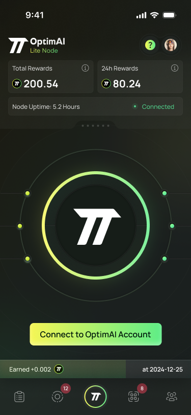

# OptimAI Edge Node

:::tip[Overview]
The **OptimAI Edge Node** is a mobile-centric solution designed specifically for smartphones, bringing the power of the OptimAI Network to users on the go. It is tailored to leverage the unique capabilities of mobile devices, enabling seamless participation in the network. Additionally, future support is planned for IoT devices, expanding the node’s versatility.
:::

## Installation

The OptimAI Edge Node is available for download on iOS and Android devices.

### iOS Devices
Download on the **[App Store](https://apps.apple.com/us/app/optimai-edge-node/id6746382051)**.

**Requirements:** iOS 15.1 or later.

### Android Devices
Download on **[Google Play](https://play.google.com/store/apps/details?id=network.optimai.edgenode)**.

**Requirements:** Android 7.0 or higher.

### IoT Devices (Coming Soon)
Support for IoT devices, such as Raspberry Pi and Jetson Nano, is planned for future releases.

## Available Tasks

The OptimAI Edge Node enables users to contribute to the network through tasks optimized for mobile and IoT environments:

- **DePIN Tasks:** Participate in decentralized physical infrastructure network (DePIN) activities, adapted for the performance and connectivity of mobile and IoT devices.
- **Data Tasks:** Engage in data-related activities, such as collection and validation, leveraging device-specific capabilities like cameras, sensors, or local processing power.

## Supported Platforms

- **Mobile Apps:** iOS and Android.
- **IoT Devices:** Raspberry Pi and Jetson Nano (planned for future releases).

---