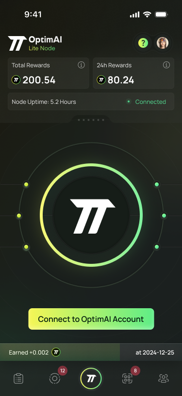

# OptimAI Edge Node

:::tip[Overview]
OptimAI Edge Node brings the network to mobile devices and future IoT environments. It is designed for local, contextual, and lightweight edge participation.
:::

Edge Nodes expand OptimAI beyond desktops and browser extensions. Mobile devices can contribute unique context such as location-aware tasks, real-time interactions, sensor-adjacent signals, and low-latency processing.

## Installation

### iOS

Download OptimAI Edge Node on the [App Store](https://apps.apple.com/us/app/optimai-edge-node/id6746382051).

Requirement: iOS 15.1 or later.

### Android

Download OptimAI Edge Node on [Google Play](https://play.google.com/store/apps/details?id=network.optimai.edgenode).

Requirement: Android 7.0 or higher.

### IoT

Future support is planned for devices such as Raspberry Pi, Jetson Nano, and other edge environments.

## Available Tasks

- lightweight data validation
- mobile-first participation
- edge context contribution
- local preprocessing where supported
- future sensor and IoT workflows
- network participation when desktop access is unavailable

## Why Edge Matters

The agentic internet will not live only in desktop browsers. It will span mobile devices, local environments, wearable contexts, IoT systems, and real-world signals.

Edge Node gives OptimAI a path to that future while preserving the same principles: user control, privacy-aware processing, and reward-aligned contribution.
