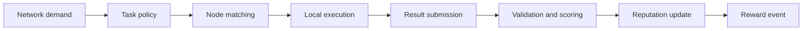

# How OptimAI Nodes Work

OptimAI Nodes turn user devices into network participants. They do not all perform the same work. A Lite Node may validate simple tasks; a Core Node may run Claw workflows and extraction jobs; an Edge Node may support mobile and local-context tasks.

## Task Lifecycle

## What A Node Can Contribute

| Contribution | Description |
| --- | --- |
| **Bandwidth** | Helps the network access, refresh, and route data. |
| **Browser execution** | Allows approved browser-native tasks, especially on Core Node. |
| **Validation** | Reviews or confirms data quality, labels, and relevance. |
| **Compute** | Runs preprocessing, embeddings, extraction, or future inference support. |
| **Storage** | Supports dataset and task-related persistence where enabled. |
| **Feedback** | Provides human correction and approval signals. |

## Permission Model

Nodes should make task permissions visible before sensitive work runs.

- Public sources can be processed as standard network tasks.
- Authenticated or personal sources require user approval.
- Resource usage should respect user-defined limits.
- Sensitive raw data should stay local whenever possible.
- Shared outputs should be anonymized, structured, or scoped to the task.

## Rewards

Rewards are based on useful contribution, not simply activity count. Inputs can include:

- task completion
- result quality
- validation accuracy
- uptime
- resource contribution
- campaign demand
- node reputation

Reward details may vary by task type and network policy.

## Mining And Validation Example

1. The network creates a source-refresh or validation task.
2. Eligible nodes receive the task based on capability and availability.
3. The node processes the task locally.
4. The result is submitted with metadata.
5. The Reinforcement Data Layer checks quality and freshness.
6. The account receives a reward event if the contribution is accepted.

import miningVideo from '@site/docs/assets/videos/lite-node-mining.mp4';

<video controls width="400">
  <source src={miningVideo} type="video/mp4" />
  OptimAI Lite Node mining and earning process
</video>

## Node Management

Use the node dashboard or CLI to:

- sign in and connect your account
- start or stop node participation
- check status and uptime
- view reward balance
- adjust task and resource preferences
- update node software

## Operational Tips

- Keep the node updated.
- Keep Docker running for Core Node and CLI workflows that require it.
- Use stable connectivity for higher reliability.
- Review permissions before enabling authenticated or personal workflows.
- Use Core Node for Claw and advanced task execution.
