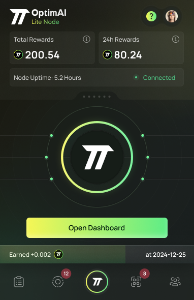

# OptimAI Lite Node

:::tip[Overview]
The **OptimAI Lite Node** serves as a straightforward and accessible entry point for joining the OptimAI Network. Designed to be lightweight and minimally intrusive, it allows users to participate with ease, making it ideal for fostering a large and diverse community of contributors.
:::

## Installation

The OptimAI Lite Node is available through two primary channels: browser extensions and Telegram Mini Apps. Follow the steps below to get started.

### Browser Extensions

1. **Chrome, Opera, Brave:**
   - Visit the [Chrome Web Store](https://chromewebstore.google.com/detail/optimai-lite-node/njlfcjdojmopagogfpjgcbnpmiknapnd).
   - Click "Add to Chrome" and follow the prompts to install.

   

### Telegram Mini Apps

1. **Locate the OptimAI Bot:**
   - Open Telegram and search for "@OptimAI_Node_Bot" or click [here](https://t.me/OptimAI_Node_Bot) to access it directly.

2. **Start the Bot:**
   - Tap "Start" to begin interacting with the bot.

3. **Set Up Your Node:**
   - Follow the bot’s guided instructions to activate your node and link it to your account.

## Available Tasks

The OptimAI Lite Node supports simple yet impactful tasks that allow users to contribute to the network effortlessly:

- **Contribute Network Bandwidth:** Share your unused network bandwidth to assist in data scraping tasks, helping gather valuable information for the OptimAI Network.
- **Data Validation:** Participate in validating collected data to ensure its accuracy and reliability, supporting the network’s quality standards.

## Supported Platforms

- **Browser Extensions:** Currently compatible with Chrome, Opera, and Brave.
- **Telegram Mini Apps:** Accessible via the Telegram platform on any device supporting the app.

---