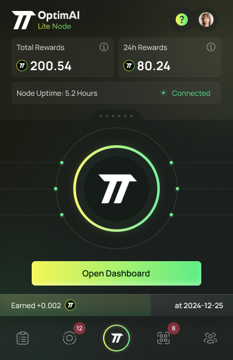

# OptimAI Lite Node

:::tip[Overview]
OptimAI Lite Node is the easiest way to join OptimAI Network. It is designed for lightweight participation through browser extensions and Telegram, helping users contribute validation, bandwidth, referrals, and simple data tasks.
:::

Lite Node makes OptimAI accessible to the widest community. You do not need advanced hardware or technical setup to start contributing.

## What Lite Node Can Do

- complete lightweight validation tasks
- contribute bandwidth where supported
- participate in referral and onboarding programs
- help verify data quality
- support early network growth
- connect users to future OPI reward opportunities

## Installation

### Browser Extension

OptimAI Lite Node is available for Chrome-compatible browsers.

1. Open the [Chrome Web Store listing](https://chromewebstore.google.com/detail/optimai-lite-node/njlfcjdojmopagogfpjgcbnpmiknapnd).
2. Click **Add to Chrome**.
3. Follow the prompts to install.
4. Open the OptimAI icon and connect your account.

Supported browsers include Chrome, Brave, and Opera.

### Telegram Mini App

1. Open Telegram.
2. Visit [@OptimAI_Node_Bot](https://t.me/OptimAI_Node_Bot).
3. Tap **Start**.
4. Follow the guided setup.

## Best For

- users new to OptimAI
- community members who want simple participation
- people who want to validate data or complete small tasks
- users without dedicated compute hardware

## Relationship To Other Nodes

Lite Node is the simplest entry point. Users who want deeper participation can move to Core Node for more advanced browser, compute, and extraction workloads, or Edge Node for mobile participation.
