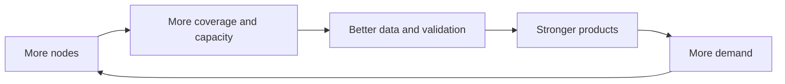

# What Is OptimAI Node?

:::tip[Overview]
OptimAI Nodes are the participation layer of OptimAI Network. They let users contribute data, validation, bandwidth, compute, storage, edge context, and browser-native task execution in exchange for network rewards.
:::

Nodes are how OptimAI becomes a decentralized intelligence network instead of a centralized AI service. Every node adds capacity to the system: more coverage, more validation, more compute, more resilience, and more context for OptimAI products.

## Node Types

| Node | Best for | Typical contribution |
| --- | --- | --- |
| **Lite Node** | Everyday users and community onboarding. | validation, bandwidth, lightweight tasks, referrals |
| **Telegram Node** | Community participation from Telegram. | simple missions, onboarding, validation |
| **Core Node** | Power users, developers, and operators. | Claw runtime, browser tasks, extraction, compute, storage, campaigns |
| **CLI Node** | Servers and headless environments. | persistent Core Node operation, status checks, rewards |
| **Edge Node** | Mobile users and future IoT environments. | mobile participation, edge context, lightweight compute |

## What Nodes Do

### Data Operations

Nodes can help the network collect, structure, and improve data:

- data mining and crawling
- OptimAI Claw workflow and extraction tasks
- annotation and labeling
- data validation
- source freshness checks
- quality review and human feedback

### DePIN Operations

Nodes can contribute infrastructure:

- bandwidth
- compute
- storage
- uptime
- edge processing
- task execution capacity

### Agent Support

Nodes help OptimAI products and agents access better intelligence:

- Search can retrieve fresher and broader sources.
- Claw can execute research, extraction, monitoring, and workflow tasks.
- Persona Agents can use trusted context and personal workflows.
- Developers can build on stronger network data.

## Reward Logic

OptimAI rewards are designed around useful contribution. Over time, the network can weigh:

- task difficulty
- contribution quality
- validation accuracy
- uptime and reliability
- bandwidth or compute provided
- campaign demand
- node reputation

## Why Nodes Matter

OptimAI’s network effects start with nodes:

By running a node, contributors help build the intelligence layer used by OptimAI Search, OptimAI Claw, Persona Agents, and future developer applications.
