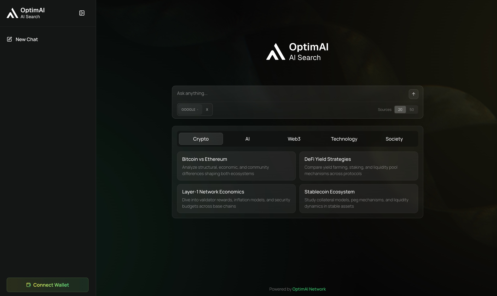
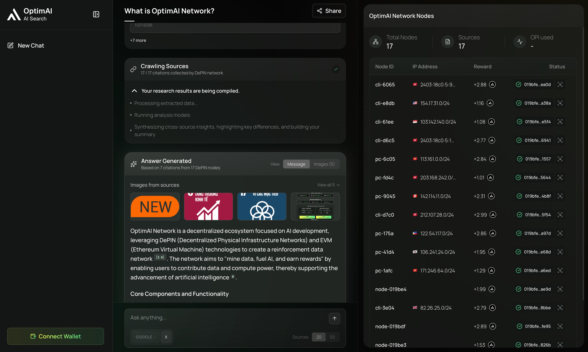

# OptimAI Search

OptimAI Search is OptimAI’s Web3 search engine: a decentralized, community-powered way to explore the open web and social sources. Core Nodes continuously crawl, clean, and vectorize public data across web pages, forums, and social platforms to build an open, real-time, machine-readable knowledge layer with semantic embeddings, metadata, and freshness/provenance tracking. When you search, a global network of nodes gathers and verifies sources in parallel, then the AI agent synthesizes them into a clear, useful response with supporting images for visual context.

:::tip[Try it now]
[Open OptimAI Search](https://search.optimai.network/)
:::

:::tip[Quick idea]
Think of OptimAI Search as a pipeline: **query → network nodes → AI analysis → answer + sources + images**.
:::

## What you get
- A synthesized answer backed by sources from the web and social platforms.
- Visual context with related images when available.
- Fast, structured results from a decentralized network of nodes that scales as more Core Nodes join.

## Why it’s different
OptimAI Search is built on open, community-owned infrastructure:
- **Decentralized and distributed**: A global network of nodes crawls and validates data for faster, more resilient search.
- **Deep, adaptive context**: The system focuses on intent and meaning to surface answers that match what you’re looking for.
- **Boundless results**: Search across a large, DePIN-powered source set for deeper, more accurate insights.
- **Social + web access**: Find information from the open web and major social platforms in one experience.
- **Community compute**: The Web3 Compute Engine turns community GPUs into a distributed AI cloud so models run closer to the data.

## How OptimAI Search works
1) You enter a query.
2) OptimAI Network nodes collect and verify relevant sources from the web and social data.
3) The AI agent filters for relevance and clarity, then synthesizes the submissions.
4) You receive an answer, citations, and images.

## The power behind every search
- **Ignite the query**: Type freely or choose a signal. OptimAI turns curiosity into real-time research across the web and social data.
- **Nodes in motion**: Your query activates a global network of nodes. Each one crawls sources and verifies results simultaneously.
- **Delivering the best**: OptimAI compiles everything into a single, precise result filtered for relevance and clarity.

## How to use OptimAI Search
1) Open OptimAI Search.
2) Type a question or topic and run the search.
3) Review the answer, sources, and images.
4) (Optional) Connect your wallet for a Web3-native experience.

:::note[Images in results]
OptimAI Search returns images when they add visual context. Some queries may not have strong visual matches—try adding keywords like “diagram”, “example”, or “architecture”.
:::

## Tips for better results
- Ask specific questions (include time range, location, or domain if relevant).
- Use natural language (e.g., “Compare X vs Y” or “Summarize the latest on Z”).
- For deeper results, run a follow-up query to narrow the scope.

## Key capabilities
- Crawls and indexes the open web and social platforms.
- Generates semantic embeddings and metadata for retrieval.
- Tracks source provenance, freshness, and quality.
- Expands automatically as more Core Nodes join the network.

## Developer ecosystem (Search APIs and SDKs)
OptimAI provides builders with open interfaces to tap directly into search:

- **Search API (coming soon)**: Query the Web3 Search Engine with semantic, vector, or keyword filters.
- **Agent SDKs (coming soon)**: Build autonomous agents that search, learn, and act across the OptimAI ecosystem.

**Example use cases**
- Real-time AI search assistants and dashboards.
- Social trend trackers and intelligence agents.
- Research and knowledge retrieval systems.

## Example searches
- “What is OptimAI Network?”
  - You will see: a concise summary, key sources, and related images.
- “Best practices for securing smart contracts in DeFi”
  - You will see: a synthesized checklist with citations.
- “Compare carbon capture methods: direct air capture vs point-source”
  - You will see: a side-by-side overview with sources.
- “How do decentralized identity wallets work?”
  - You will see: a step-by-step explanation with references.
- “What are common failure modes in large language models?”
  - You will see: an analysis with cited sources and visuals.

## Troubleshooting
- **I do not see images**: Some topics do not have strong visual matches. Try a more specific query.
- **My search did not run**: Try again in a moment or refresh the page.
- **Results feel too broad**: Narrow the query by adding a timeframe, industry, or location.

## FAQ
**Is OptimAI Search centralized?**
No. OptimAI Search uses decentralized nodes in the OptimAI Network to gather sources, then the AI agent synthesizes results.

**Do I need a wallet to search?**
No. A wallet is optional for search. You can use OptimAI Search without connecting one.

**Where do the answers come from?**
Sources are gathered from across the Internet, then analyzed and summarized by our AI agent. You can review citations to verify details.
