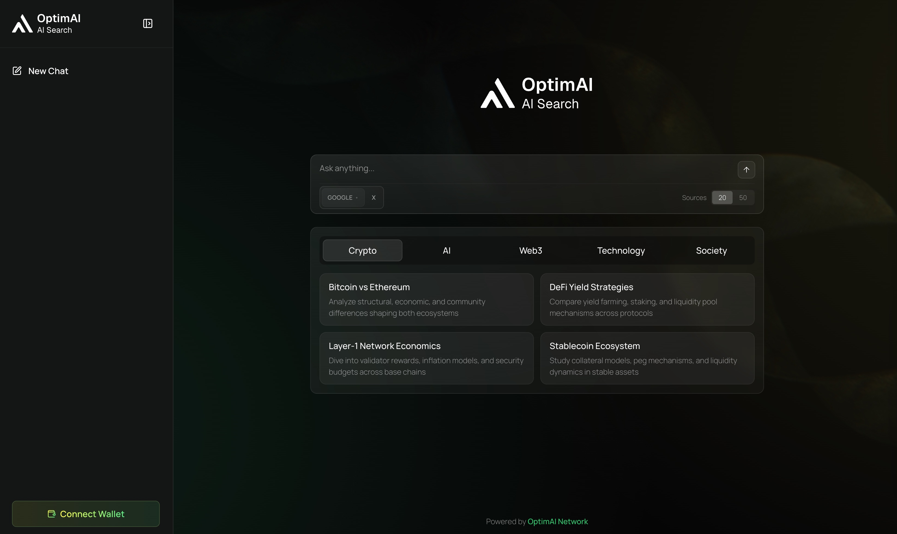
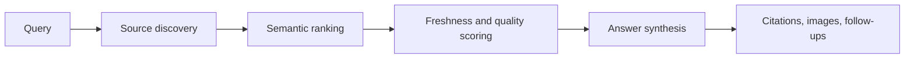
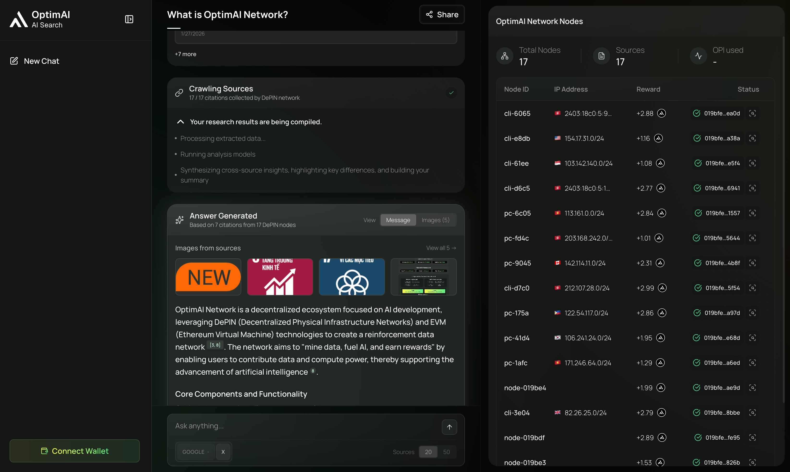

# OptimAI Search

OptimAI Search is the context layer of the OptimAI stack. It gives users and agents a way to retrieve current information from web, social, and network-indexed sources, then return a synthesized answer with supporting sources.

:::tip[Try it]
[Open OptimAI Search](https://search.optimai.network/)
:::

## What Search Does

Search turns a question into usable context:

```mermaid
flowchart LR
  A["Query"] --> B["Source discovery"]
  B --> C["Semantic ranking"]
  C --> D["Freshness and quality scoring"]
  D --> E["Answer synthesis"]
  E --> F["Citations, images, follow-ups"]
```

## Why It Exists

Agents need current grounding. A model can reason well and still fail if its context is stale, incomplete, or unverifiable. Search gives OptimAI agents a retrieval layer they can call before they answer, extract, or act.

## Position In The Stack

| Layer | Search relationship |
| --- | --- |
| **Claw** | Supplies the sources Claw needs before execution. |
| **Persona** | Refreshes context while applying user-approved memory. |
| **Nodes** | Expand source discovery, refresh capacity, and network coverage. |
| **Reinforcement Data Network** | Adds freshness, quality, and provenance signals. |
| **Builder interfaces** | Exposes live context through API, MCP, and x402 flows. |

## Capabilities

- natural-language search
- source-backed answer synthesis
- web and social context when available
- related images for visual context
- semantic matching beyond keyword search
- freshness and provenance signals
- developer access through API and MCP workflows

## Product Relationships

| Product | How it uses Search |
| --- | --- |
| **Claw** | Finds current sources before executing a research, extraction, or monitoring workflow. |
| **Persona Agent** | Retrieves updated context while applying user-approved memory and preferences. |
| **Data campaigns** | Uses Search to discover candidate sources and define extraction targets. |
| **Builder tools** | Use the Search API, MCP server, and x402 SDK to bring live context into external agents. |

## Search Flow

1. A user or agent submits a query.
2. Search routes the request through retrieval and source discovery.
3. Candidate sources are ranked by relevance, freshness, and quality.
4. The answer layer synthesizes a response.
5. Citations and follow-up paths are returned.
6. Feedback can improve future retrieval and ranking.

## Developer Access

OptimAI Search is available through several builder paths:

| Interface | Use case |
| --- | --- |
| **Search API** | Direct server-side integration for applications and workflows. |
| **Search MCP** | Add OptimAI Search as a tool inside MCP-compatible coding agents or desktop AI hosts. |
| **x402 SDK** | Build paid, agent-native search flows using HTTP 402-style payment requests. |
| **Search Skill** | Installable guidance for AI coding agents that need to use OptimAI Search integrations correctly. |

Start with [Developer Get Started](./builders/get-started.mdx) or [API Overview](./builders/api-overview.mdx).

## Output Quality

A high-quality Search result should be:

- grounded in sources
- clear about uncertainty
- current for the requested timeframe
- easy for Claw or another agent to reuse
- transparent enough for a user to inspect

## Query Tips

- Ask complete questions.
- Include timeframes when recency matters.
- Name the source type, market, chain, country, product, or audience.
- Ask for a comparison, checklist, timeline, or risk analysis when you need structure.
- Use follow-up queries to narrow scope.

## FAQ

**Do I need a wallet to search?**  
No. Basic product usage can be separate from wallet-connected or x402 flows.

**Is Search only for humans?**  
No. Search is also designed as a context layer for agents, APIs, and MCP-compatible tools.

**Where do answers come from?**  
Answers are generated from retrieved or indexed sources. Citations help users inspect the context behind the answer.
