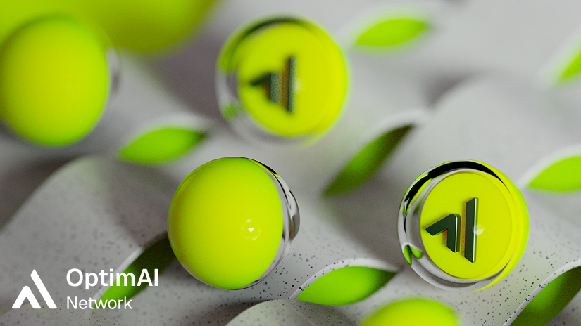
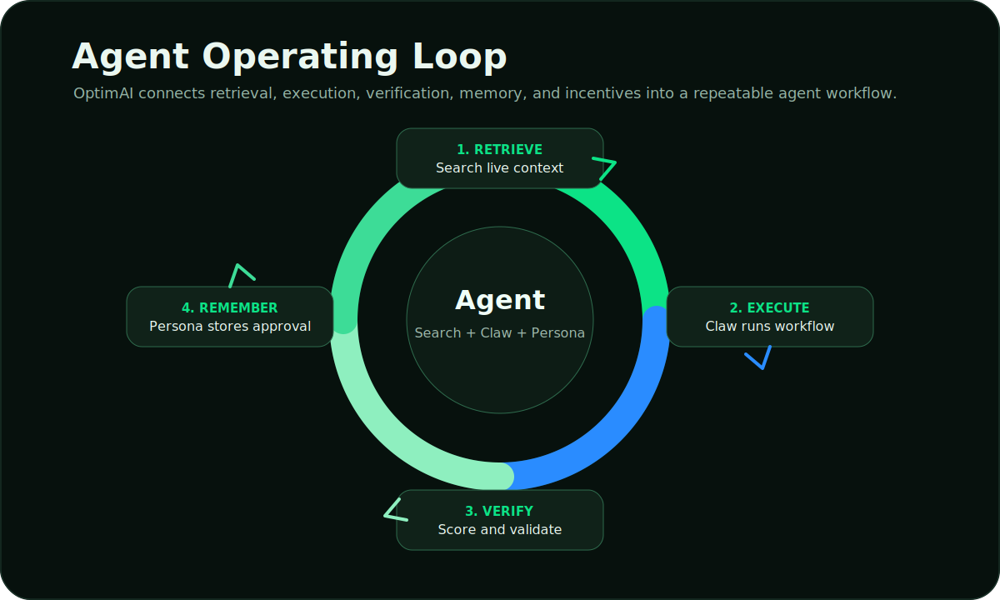

# Introduction

OptimAI Network is built for a specific shift in AI: agents are moving from answering questions to operating across workflows.

That shift requires infrastructure. Agents need current context, a runtime for execution, memory that users control, and a trust layer that can evaluate data quality. OptimAI organizes those requirements into one connected network.

## The Core Model

| Requirement | OptimAI component | What it provides |
| --- | --- | --- |
| **Live context** | Search | Source-backed retrieval from web, social, and network-indexed data. |
| **Execution** | Claw | A node-resident runtime for research, extraction, monitoring, and workflows. |
| **Memory** | Persona | User-approved preferences, projects, sources, decisions, and recurring tasks. |
| **Trust** | Reinforcement Data Network | Provenance, freshness, validation, quality scoring, and feedback loops. |
| **Infrastructure** | Nodes | Distributed browser access, compute, bandwidth, storage, validation, and execution. |
| **Coordination** | OPI, Marketplace, Chain | Rewards, access, reputation, distribution, staking, and governance. |

## What Makes OptimAI A Network

OptimAI is not only a search product, an agent app, or a token system. The value comes from the connection between them:

1. Users and builders create demand for context and execution.
2. Nodes perform useful data, compute, validation, and workflow tasks.
3. The data layer turns raw results into trusted context.
4. Search, Claw, and Persona use that context in products.
5. Feedback and rewards improve the next cycle.

## The Product Stack

### Search

Search is the context layer. It helps humans and agents retrieve current information with citations, source links, and freshness signals.

### Claw

Claw is the execution layer. It turns a goal into steps: search, extract, compare, monitor, summarize, and produce an inspectable result.

### Persona

Persona is the memory layer. It gives agents continuity while keeping personal context explicit and user-controlled.

### Nodes

Nodes are the infrastructure layer. They make OptimAI decentralized by contributing browser execution, bandwidth, compute, storage, validation, and edge context.

## The Practical Outcome

OptimAI gives agents a better operating environment: they can retrieve current context, run workflows, validate outputs, remember approved decisions, and reward contributors who improve the network.
