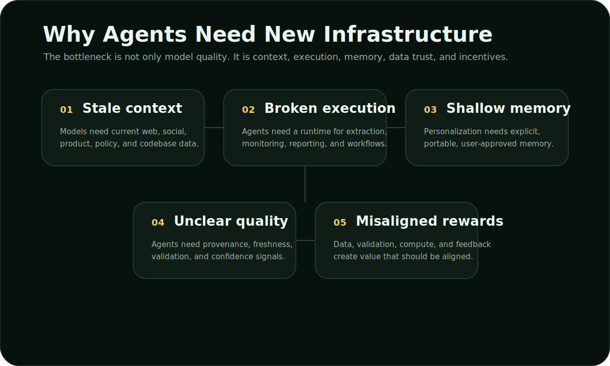

# The Problem

The next generation of AI is agentic: systems that search, reason, execute, remember, and improve. But most of today’s AI infrastructure was built for static chat, not autonomous work.

## The Five Gaps

### 1. Context Becomes Stale

Agents fail when they rely on outdated context. Markets change, codebases change, policies change, product pages change, communities change. A useful agent needs live retrieval and source refresh before it acts.

### 2. Execution Breaks At The Handoff

Many assistants can summarize a topic. Fewer can complete a workflow: gather sources, extract fields, compare changes, prepare a report, preserve decisions, and repeat the process next week.

### 3. Memory Is Not User-Owned

Personalization is often hidden inside a platform. Users need explicit control over what an agent remembers: preferences, projects, trusted sources, prior decisions, and workflow patterns.

### 4. Data Quality Is Hard To Inspect

Raw text is not enough. Agents need provenance, freshness, validation status, source quality, and confidence signals. Without those, they cannot reliably separate current evidence from stale or low-quality data.

### 5. Contributors Are Not Aligned

Useful intelligence depends on data, validation, feedback, bandwidth, compute, and workflow execution. Centralized systems capture most of that value. Network infrastructure should reward useful contribution.

## Why This Matters

If these gaps are not solved, agents remain impressive demos but unreliable operators. They can answer, but they cannot consistently act with current context, trusted data, user-approved memory, and accountable execution.

## OptimAI’s Position

OptimAI addresses the full operating loop:

| Gap | OptimAI response |
| --- | --- |
| Stale context | Search retrieves live, source-backed information. |
| Broken execution | Claw runs research, extraction, monitoring, and workflow tasks. |
| Weak memory | Persona stores user-approved context and preferences. |
| Unclear quality | Reinforcement Data Network validates and scores data. |
| Misaligned contribution | Nodes and OPI connect useful work with rewards. |
