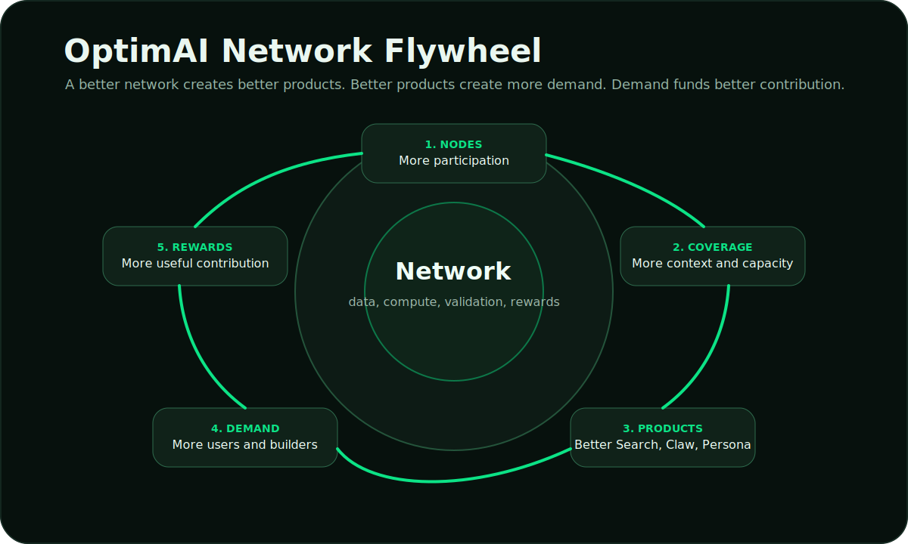
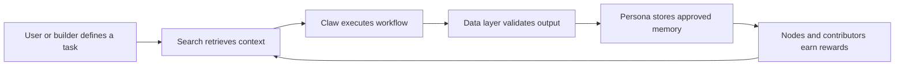

# The OptimAI Solution

OptimAI connects the missing pieces of agent infrastructure into one operating system for decentralized intelligence.

## The Solution Stack

| Layer | Function | Product or system |
| --- | --- | --- |
| **Context** | Retrieve current source-backed information. | OptimAI Search |
| **Execution** | Run research, extraction, monitoring, and workflows. | OptimAI Claw |
| **Memory** | Preserve user-approved identity, preferences, and decisions. | Persona Agent |
| **Trust** | Structure, validate, score, and improve data. | Reinforcement Data Network |
| **Infrastructure** | Provide distributed browser access, compute, bandwidth, and validation. | OptimAI Nodes |
| **Distribution** | Package and discover agents, workflows, datasets, and services. | OptimAI Marketplace |
| **Coordination** | Align contribution, access, reputation, and governance. | OPI and OptimAI Chain |

## How It Works

## What This Enables

### Source-backed answers

Search gives agents current context with citations and source signals. This makes answers easier to inspect and reuse.

### Workflow execution

Claw moves beyond response generation. It can gather information, extract structured records, compare changes, monitor sources, and return a workflow result.

### User-owned personalization

Persona makes personalization explicit. The user chooses what the agent can remember and apply in future tasks.

### Verifiable data

The Reinforcement Data Network keeps provenance, freshness, validation, feedback, and quality signals attached to useful data.

### Network-aligned economics

Nodes and validators contribute the infrastructure behind OptimAI. OPI connects useful work with rewards, access, campaigns, staking, marketplace activity, and governance.

## The Flywheel

1. More node participation increases coverage and execution capacity.
2. Better coverage improves Search, Claw, and Persona.
3. Better products create more user and builder demand.
4. More demand funds higher-quality network contribution.
5. Better contribution improves the next cycle.

## End State

OptimAI is designed to become infrastructure for the agent-native internet: a network where agents can search, verify, execute, remember, pay for services, and improve through feedback while contributors participate in the value they create.
