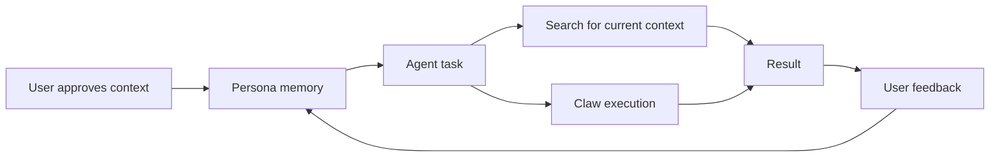

# OptimAI Persona Agent

Persona Agent is the memory and identity layer of OptimAI. It lets users turn approved context into a reusable agent profile: preferences, projects, trusted sources, workflows, and voice.

Search gives the agent current context. Claw gives it execution. Persona gives it continuity.

:::tip[Try it]
[Open Persona Agent](https://optimai.im/download/)
:::

## Position In The Stack

| Layer | Persona relationship |
| --- | --- |
| **Search** | Uses live context while respecting trusted sources and preferences. |
| **Claw** | Applies memory to research, extraction, and recurring workflows. |
| **Nodes** | Provide the runtime and network context behind agent tasks. |
| **Reinforcement Data Network** | Helps decide what context is reliable enough to reuse. |
| **Marketplace** | Can support reusable persona-aware agents and workflows with permission boundaries. |

## Why Persona Matters

Most AI assistants reset between sessions or depend on opaque platform memory. Persona Agent is designed around explicit, user-approved memory.

That matters because useful agents need to remember:

- what the user is working on
- which sources the user trusts
- how the user prefers output
- what decisions have already been made
- which workflows repeat
- what should remain private

## Memory Model

| Memory type | Examples | Default stance |
| --- | --- | --- |
| **Preferences** | tone, format, risk tolerance, preferred tools | private |
| **Projects** | goals, plans, documents, milestones | private |
| **Sources** | watchlists, trusted sites, accounts, dashboards | private or scoped |
| **Workflows** | weekly brief, market map, report template | private |
| **Decisions** | prior comparisons, selected options, rejected paths | private |
| **Feedback** | corrections, approvals, ratings | private or aggregated |

## Persona Loop

## Capabilities

### Personal memory

Store user-approved preferences, sources, project context, and workflow patterns.

### Context-aware research

Use Search while applying the user’s watchlists, preferred formats, and known goals.

### Workflow continuity

Reuse previous decisions and task structures instead of rebuilding a workflow from scratch.

### Controlled sharing

Keep personal memory private by default. Share only what the user explicitly approves for a task, campaign, or marketplace agent.

## Memory Governance

Persona should make memory legible. A user should be able to understand:

- what was saved
- why it was saved
- where it came from
- whether it is private, scoped, or shared
- how to edit or delete it
- which agent or workflow can use it

## Example Personas

| Persona | What it tracks |
| --- | --- |
| **Founder** | competitors, hiring plans, investor updates, roadmap decisions |
| **Researcher** | topics, papers, citations, source quality, open questions |
| **Trader** | narratives, risk rules, protocols, on-chain and social signals |
| **Creator** | voice, audience, content pillars, campaign performance |
| **Developer** | stack preferences, APIs, codebase patterns, issue context |

## Relationship To The Stack

- **Search** brings in new context.
- **Claw** executes research, extraction, and workflow steps.
- **Persona** decides what should be remembered.
- **Nodes** provide the distributed runtime and data layer.
- **OPI** can support premium agent services, marketplace use, and reward flows.

## Builder References

See [Persona API preview](./builders/api-overview.mdx#persona-api), [SDK memory example](./builders/sdk-quickstart.mdx#preview-persona-memory-pattern), and [Persona memory schema](./builders/schemas.mdx#persona-memory).
