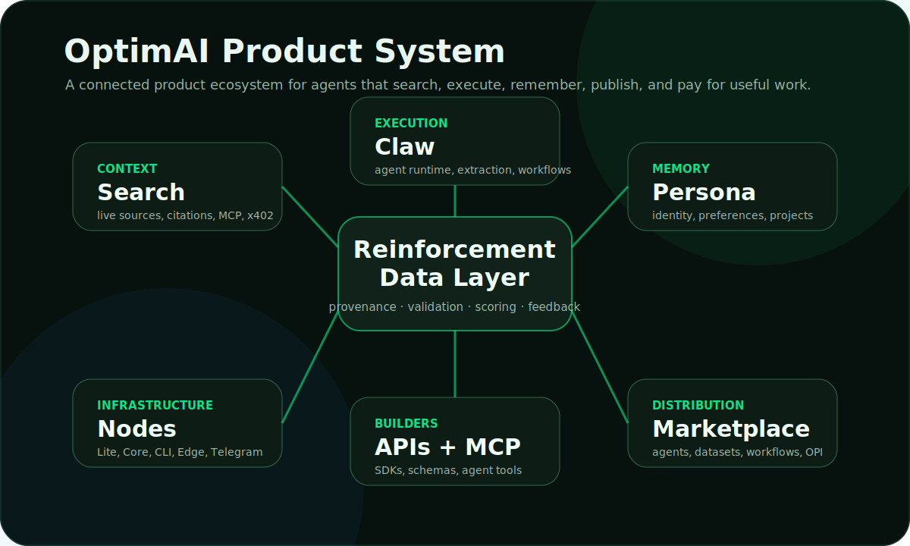

# Products Overview

OptimAI products are designed to work as one agent infrastructure stack. Each product has a clear role, but the system becomes more powerful when they are composed together.

## Product Roles

| Product | Role | Primary user |
| --- | --- | --- |
| **OptimAI Search** | Context layer for live, source-backed retrieval. | users, agents, developers |
| **OptimAI Claw** | Execution layer for research, extraction, monitoring, and workflows. | users, operators, builders |
| **Persona Agent** | Memory and identity layer for user-approved context. | users, agent builders |
| **Agent Platform** | Composition layer for building reusable agent workflows. | builders, teams, marketplace creators |
| **OptimAI Nodes** | Infrastructure layer for data, compute, bandwidth, validation, and runtime capacity. | contributors, operators |
| **Marketplace** | Distribution layer for agents, datasets, workflows, and services. | users, builders, ecosystem partners |

## How The Products Work Together

1. **Search** retrieves current context and source evidence.
2. **Claw** turns the goal into a workflow and executes the steps.
3. **Persona** applies approved memory, preferences, and previous decisions.
4. **Nodes** provide execution capacity, data access, validation, and reputation.
5. **Marketplace** makes useful agents, workflows, and datasets reusable.
6. **OPI** connects contribution, access, and governance.

## Example: Market Intelligence Workflow

## What Makes The Product System Different

- **It is composable:** products can be used separately or chained into agent workflows.
- **It is inspectable:** source links, provenance, validation, and quality signals are part of the model.
- **It is user-controlled:** Persona memory and permissioned sources are explicit.
- **It is network-powered:** nodes and validators expand coverage, execution, and trust.
- **It is economically aligned:** OPI and marketplace primitives connect useful work with value flow.

## Next Pages

- [OptimAI Claw](./optimai-claw.md)
- [OptimAI Search](./optimai-search.mdx)
- [Persona Agent](./persona-agent.mdx)
- [Agent Platform](./optimai-agent.mdx)
