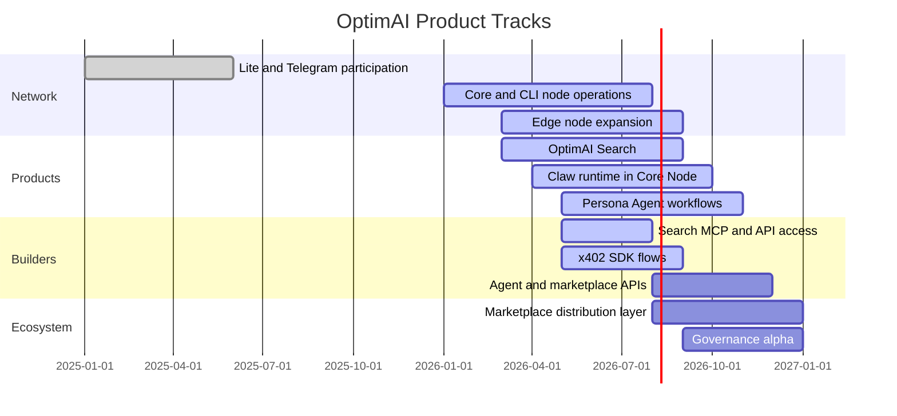

# Roadmap

OptimAI’s roadmap should be read as a set of product tracks, not a list of disconnected features. The network becomes stronger when the tracks reinforce each other: better nodes improve data; better data improves Search and Claw; better products create more demand; demand creates more rewards and builder activity.

## Product Tracks

| Track | Focus |
| --- | --- |
| **Search** | Live context layer for users, agents, APIs, MCP, and x402 flows. |
| **Claw** | Core Node execution runtime for research, extraction, monitoring, and workflow automation. |
| **Persona** | User-owned memory, identity, preferences, and portable agent profiles. |
| **Nodes** | Lite, Core, Edge, CLI, and Telegram participation with stronger task routing and reputation. |
| **Developer platform** | APIs, MCP, SDKs, schemas, examples, and agent integrations. |
| **Marketplace** | Distribution layer for agents, datasets, workflows, and services. |
| **Economy and governance** | OPI utility, rewards, staking, campaign settlement, and governance processes. |

## Current Priorities

- Improve the clarity and reliability of Search as an agent context layer.
- Make Claw workflows more repeatable, inspectable, and easier to run from Core Node.
- Strengthen Persona memory controls and user-approved context flows.
- Expand developer access through MCP, API keys, x402 SDK, and examples.
- Improve node reputation, reward accounting, and task transparency.
- Prepare marketplace primitives for reusable agents, datasets, and workflows.

## Milestone View

## Roadmap Notes

- Dates are planning windows, not final launch commitments.
- Developer interfaces should be marked preview until production contracts are stable.
- Tokenomics should remain utility-focused until supply and allocation details are finalized.
- Security, privacy, and permission controls should be reviewed before each major product expansion.

## North Star

OptimAI is moving toward a live intelligence network for the agent-native internet: agents that can search, verify, remember, execute, pay for services, and improve through feedback while users and contributors keep a stake in the network they power.
