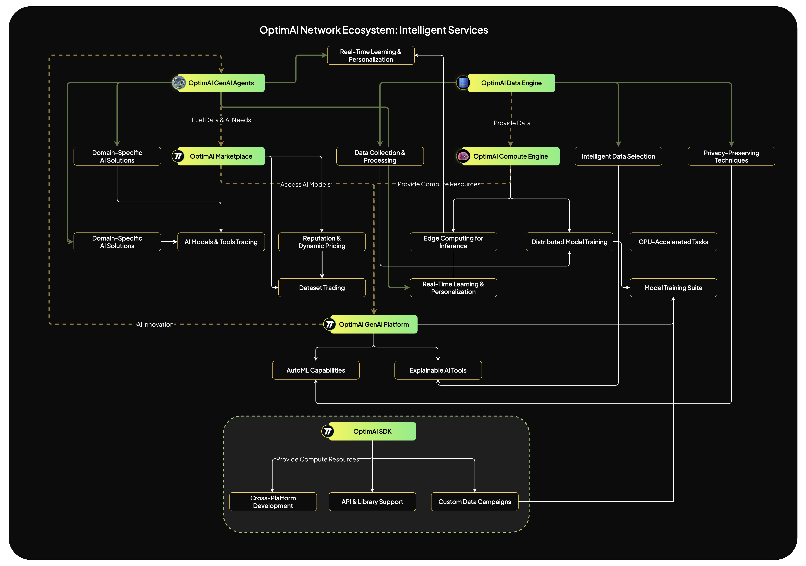

# OptimAI Intelligence Services
The OptimAI Network Intelligence Services is a comprehensive suite of interconnected components designed to create a dynamic and robust environment for AI development. By seamlessly integrating data collection, processing, computation, and deployment, we provide a holistic platform that empowers users, developers, and organizations to harness the full potential of AI. This ecosystem not only addresses the current challenges in AI but also lays the groundwork for future advancements, making it a compelling proposition for our community and investors.

:::tip[The key components of the OptimAI Intelligence Services includes]
1. OptimAI **Data Engine**
2. OptimAI **Compute Engine**
3. OptimAI **GenAI Agent Platform**
:::

Each component plays a crucial role in the ecosystem, and together, they form a synergistic whole that is greater than the sum of its parts.

## OptimAI Data Engine
*Harnessing the Power of Data for Superior AI*
### What is the OptimAI Data Engine?
The OptimAI Data Engine is the core component responsible for managing the entire lifecycle of data within the network. It oversees data collection, processing, storage, and distribution, ensuring that high-quality, relevant data is available for AI model training and deployment.

#### Key Features
- Data Aggregation: Collects data from various sources, including Browser Nodes, Mobile Nodes, and external datasets.
- Data Processing: Cleanses, normalizes, and annotates data to ensure it meets the quality standards required for effective AI training.
- Data Storage: Utilizes decentralized storage solutions for secure and scalable data retention.
- Data Distribution: Facilitates efficient data access and sharing among authorized parties within the network.

#### Innovative Aspects
- Real-Time Data Processing: Supports streaming data for applications requiring up-to-the-minute information.
- Intelligent Data Selection: Employs AI algorithms to select the most relevant data for specific model training tasks.
- Privacy-Preserving Techniques: Implements federated learning and differential privacy methods to protect user data while still extracting valuable insights.

### Benefits
- Enhanced AI Models: Access to high-quality, diverse datasets leads to more accurate and robust AI models.
- Efficiency: Automated data pipelines reduce time-to-insight, accelerating the development cycle.
- Competitive Advantage: Unique data sources provide a strategic edge in the AI marketplace.

## OptimAI Compute Engine
*Unleashing Computational Power for AI Excellence*
### What is the OptimAI Compute Engine?
The OptimAI Compute Engine is a decentralized computing platform that harnesses the collective processing power of the network's nodes. It enables distributed AI model training, inference, and other computational tasks, making high-performance computing accessible and cost-effective.
#### Key Features
- Distributed Computing: Leverages the idle computational resources of participating nodes.
- Scalable Infrastructure: Automatically adjusts to workload demands, ensuring optimal performance.
- GPU Acceleration: Supports GPU-enabled nodes for resource-intensive AI tasks.
- Edge Computing: Performs computations closer to data sources, reducing latency and bandwidth usage.
#### Innovative Aspects
- Workload Balancing: Uses intelligent scheduling algorithms to distribute tasks efficiently across the network.
- Energy Efficiency: Optimizes resource utilization to minimize energy consumption and environmental impact.
- Fault Tolerance: Implements redundancy and checkpointing to ensure resilience against node failures.
#### Benefits
- Cost Savings: Reduces the need for expensive centralized servers and cloud computing services.
- Performance: Accelerates AI model training and inference times.
- Accessibility: Democratizes access to high-performance computing resources, enabling broader participation in AI development.

## OptimAI Network Engine
*Ensuring Seamless Connectivity and Security*
### What is the OptimAI Network Engine?
The OptimAI Network Engine is the communication backbone of the ecosystem. It manages data transfer, synchronization, and security across all nodes and components, ensuring that the network operates smoothly and securely.
#### Key Features
- High-Speed Connectivity: Utilizes optimized protocols for rapid data exchange.
- Secure Communications: Implements end-to-end encryption and secure authentication mechanisms.
- Network Monitoring: Provides real-time insights into network performance and health.
- Scalability: Designed to handle increasing network traffic as the ecosystem grows.
#### Innovative Aspects
- Adaptive Routing: Dynamically selects the most efficient data paths based on network conditions.
- Decentralized DNS: Employs distributed naming services to enhance reliability and censorship resistance.
#### Benefits
- Reliability: Ensures consistent network uptime and performance.
- Security: Protects against cyber threats, safeguarding data and operations.
- Efficiency: Optimizes data flow, reducing latency and improving user experience.

## OptimAI GenAI Agent Platform
*Catalyzing the Next Generation of AI Applications*
### What is the OptimAI GenAI Agent Platform?
The OptimAI GenAI Platform is an advanced AI development environment that provides tools and infrastructure for creating, training, and deploying next-generation AI agents and models. It leverages the collective strengths of the ecosystem to push the boundaries of what's possible in AI.
#### Key Features
- Model Training Suite: Offers a comprehensive suite for training AI models, including deep learning frameworks and hyperparameter tuning tools.
- Pre-Trained Models: Provides access to a library of pre-trained models that can be fine-tuned for specific applications.
- Deployment Tools: Facilitates the deployment of AI models across various platforms and devices.
- Collaboration Spaces: Enables teams to work together on AI projects, sharing resources and expertise.
#### Innovative Aspects
- AutoML Capabilities: Implements automated machine learning features that lower the barrier to AI development.
- Explainable AI Tools: Includes tools for interpreting and explaining AI model decisions, promoting transparency.
- Ethical AI Compliance: Integrates guidelines and checks to ensure AI models adhere to ethical standards and avoid biases.
#### Benefits
- Accelerated Innovation: Streamlines the AI development process, reducing time from concept to deployment.
- Quality Assurance: Ensures that AI models are robust, reliable, and aligned with ethical considerations.
- Competitive Edge: Equips developers and organizations with cutting-edge tools to stay ahead in the AI landscape.

## Synergy Within the Ecosystem
### Creating a Self-Sustaining and Growth-Oriented Environment
The components of the OptimAI Network Ecosystem are designed to interconnect seamlessly, each enhancing the functionality and value of the others. This synergy creates a self-sustaining environment where growth in one area propels advancement across the entire network.
#### Data Fuels Compute
- The OptimAI Data Engine provides high-quality data that powers AI model training in the OptimAI Compute Engine.
- As more data becomes available, the Compute Engine can train more sophisticated models, enhancing the capabilities of the OptimAI GenAI Platform.
#### Compute Enables Innovation
- The Compute Engine's processing power supports developers using the OptimAI SDK, enabling them to build complex applications and services.
- These innovations feed back into the ecosystem, enriching the offerings in the OptimAI Marketplace.
#### Marketplace Drives Participation
- The Marketplace incentivizes users and developers by providing monetization opportunities, increasing engagement and contributions to the Data and Compute Engines.
- Successful applications and services attract more users, creating a positive feedback loop that fosters ecosystem growth.
#### GenAI Platform Advances AI
- The OptimAI GenAI Platform leverages all ecosystem components to push the frontiers of AI, developing next-generation models and agents.
- Breakthroughs achieved on the GenAI Platform benefit the entire ecosystem, providing advanced tools and capabilities to all participants.
