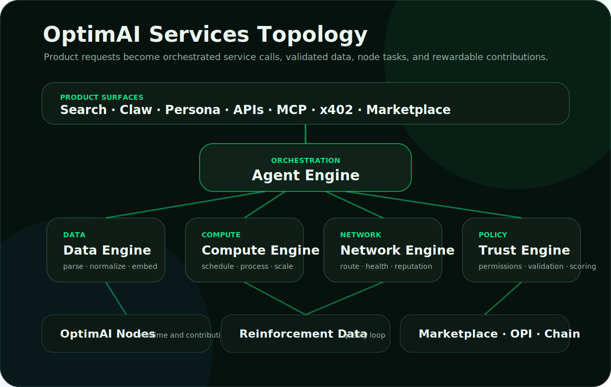
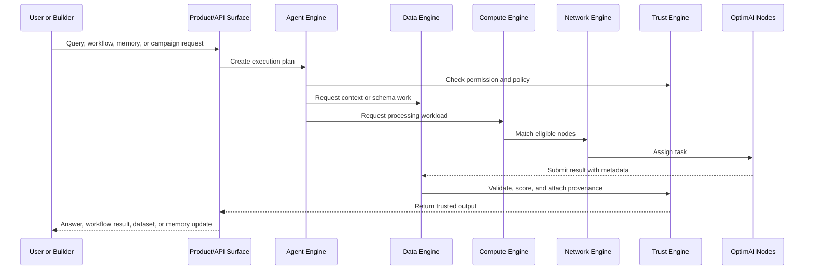

# OptimAI Services

OptimAI Services are the internal engines that make the product stack work as one system. They translate user and developer requests into agent plans, data operations, node tasks, quality checks, and rewardable contribution events.

## Service Topology

OptimAI Services sit between product surfaces and the node network.

| Surface | Service responsibility |
| --- | --- |
| **Search** | Retrieve and rank source-backed context. |
| **Claw** | Plan and execute research, extraction, monitoring, and workflow jobs. |
| **Persona** | Read and write user-approved memory under explicit permissions. |
| **APIs, MCP, x402** | Expose product capabilities to external agents and applications. |
| **Marketplace** | Package reusable agents, workflows, datasets, and services. |

## Core Engines

### Agent Engine

The Agent Engine is the orchestration layer. It receives a goal or API request, decides which tools are needed, tracks workflow state, and routes work to the other engines.

It owns:

- task planning
- tool selection
- workflow state
- Search, Claw, and Persona routing
- feedback collection
- retry and continuation logic

### Data Engine

The Data Engine turns raw sources into reusable intelligence.

It owns:

- ingestion
- parsing and extraction
- cleaning and normalization
- chunking and embeddings
- metadata enrichment
- provenance tracking
- dataset packaging
- validation queues

### Compute Engine

The Compute Engine matches workloads to available resources.

It owns:

- preprocessing jobs
- embedding generation
- extraction workloads
- inference support
- campaign processing
- workload scheduling
- resource and capability matching

### Network Engine

The Network Engine coordinates distributed participation.

It owns:

- node registration
- task routing
- health checks
- bandwidth coordination
- encrypted communication
- uptime and reliability signals
- node reputation inputs
- reward-event preparation

### Trust Engine

The Trust Engine is the policy and quality layer. It prevents generated outputs from being treated as trusted without evidence.

It owns:

- permission checks
- validation policy
- source freshness
- provenance requirements
- quality scoring
- validator sampling
- anomaly and duplicate checks
- privacy boundaries

## Request Lifecycle

```mermaid
sequenceDiagram
  participant User as User or Builder
  participant Product as Product/API Surface
  participant Agent as Agent Engine
  participant Data as Data Engine
  participant Compute as Compute Engine
  participant Network as Network Engine
  participant Trust as Trust Engine
  participant Nodes as OptimAI Nodes

  User->>Product: Query, workflow, memory, or campaign request
  Product->>Agent: Create execution plan
  Agent->>Trust: Check permission and policy
  Agent->>Data: Request context or schema work
  Agent->>Compute: Request processing workload
  Compute->>Network: Match eligible nodes
  Network->>Nodes: Assign task
  Nodes-->>Data: Submit result with metadata
  Data->>Trust: Validate, score, and attach provenance
  Trust-->>Product: Return trusted output
  Product-->>User: Answer, workflow result, dataset, or memory update
```

## Service Contracts

Each service should expose the same operational shape.

| Contract field | Description |
| --- | --- |
| **Input** | Query, URL, schema, memory item, campaign, node capability, or payment context. |
| **Policy** | Permissions, privacy, validation requirements, resource limits, and payment rules. |
| **Execution** | Tools, nodes, data jobs, compute jobs, and retries used to complete the request. |
| **Output** | Answer, record, dataset, workflow result, memory update, task result, or reward event. |
| **Trace** | Request ID, timestamp, provenance, node metadata, validation state, and quality score. |

## Quality Gates

OptimAI Services should not return high-confidence outputs without passing the relevant quality gates:

- **Permission gate:** Is the source or memory approved for this request?
- **Schema gate:** Is the expected output shape defined?
- **Provenance gate:** Can important claims or fields be traced to a source?
- **Freshness gate:** Is the source current enough for the task?
- **Validation gate:** Does the task require automated or human review?
- **Reputation gate:** Should node or source reputation affect confidence?
- **Privacy gate:** Can the output be shared, stored, or reused?

## Engine Ownership

| Engine | Primary owner in the system | Typical output |
| --- | --- | --- |
| **Agent Engine** | workflow orchestration | plan, tool call, final response |
| **Data Engine** | structured intelligence | source, citation, record, dataset |
| **Compute Engine** | workload execution | processed output, embedding, extraction result |
| **Network Engine** | node coordination | assigned task, health status, reputation signal |
| **Trust Engine** | policy and quality | validation state, quality score, permission decision |

## How Services Power Products

| Product | Service path |
| --- | --- |
| **Search** | Agent Engine -> Data Engine -> Trust Engine -> cited answer |
| **Claw** | Agent Engine -> Trust Engine -> Compute Engine -> Network Engine -> Data Engine -> workflow result |
| **Persona** | Agent Engine -> Trust Engine -> memory read/write -> feedback loop |
| **Campaigns** | Agent Engine -> Data Engine -> Network Engine -> validators -> reward events |
| **Marketplace** | Data Engine + Trust Engine + OPI coordination for packaged agents, workflows, datasets, and services |

## Design Principles

- **Separation of concerns:** planning, data, compute, network, and trust should be independently understandable.
- **Traceability:** important outputs should carry request IDs, source metadata, and validation state.
- **Policy before execution:** permission and privacy checks should run before sensitive work starts.
- **Async by default:** long-running search, extraction, and campaign work should support queued jobs and polling.
- **Composable interfaces:** Search MCP, APIs, x402, Claw jobs, and Persona memory should share object conventions.
- **Reward-aware operations:** accepted node work should produce reputation and reward signals.

## Related Pages

- [Architecture](./architecture.mdx)
- [Reinforcement Data Network](./data-network.mdx)
- [Network Operations](./network-operations.mdx)
- [API Overview](./builders/api-overview.mdx)
